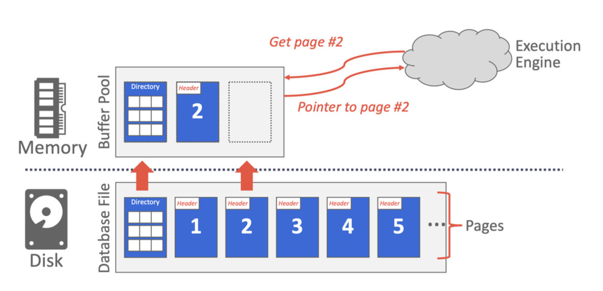

# Cmu15445 Buffer_pool


## Buffer_pool
这个project是要在存储管理器中实现一个buffer pool，即**缓冲池**。缓冲池其实就是一块大的内存区域**主内存**，负责与**磁盘**之间来回移动物理页。它使得DBMS支持大于系统可用内存的数据库。缓冲池的操作对系统中的其他部分应该是透明的。例如，系统使用唯一标识符`page_id_t`想缓冲池请求页面的时候，系统不知道该页面是否位于已经在内存中，或者是需要从磁盘检索。



实现的时候需要保证**线程安全**。多个线程可以同时访问内部数据结构，并且必须确保关键部分收到`latch`的保护。

## LRU-K 更换策略
这个组件负责跟踪缓冲池的页面使用情况。`LRUKReplacer`的最大大小与缓冲池的大小相同，但并非 replacer 中的所有帧都被视为可驱逐。`LRUKReplacer`的大小由可驱逐帧的数量表示。

LRU-K 算法移出其**后向 k 距离**为replacer中所有帧的最大值的帧。向后 k 距离的计算方法是当前时间戳与第 k 次访问的时间戳之间的时间差。历史访问次数少于 k 次的帧将为其后 k 距离指定 +inf。
**当多个帧具有 +inf 向后 k 距离时，实施普通的LRU**。

### **`Evict(frame_id_t* frame_id) -> bool`**
> 驱逐具有最大向后 k 距离的帧。将帧 ID 存储在 output 参数中并返回 True。如果没有可驱逐的帧，则返回 False。

1. 获取latch，判断如果当前大小为0，则返回false。
1. 构建`tuple(id, kthTimestamp, mostRecentTimestamp)`来存储节点信息，然后创建一个`vector<tuple>`，遍历node_store_中的所有节点，把每个节点的信息用tuple的形式放进vector中。vector为空则返回false。
1. 实现一个临时的cmp排序函数，对vector中元素进行排序`std::sort(vec.begin(), vec.end(), cmp)`，排在第一个的元素就是需要被驱逐的节点。清除节点历史、置为不可驱逐、replacer大小减1、赋值frame_id。
```c++
  auto cmp = [](const std::tuple<frame_id_t, size_t, size_t> &a, const std::tuple<frame_id_t, size_t, size_t> &b) {
    if (std::get<1>(a) != std::get<1>(b)) {
      return std::get<1>(a) > std::get<1>(b);
    }
    return std::get<2>(a) < std::get<2>(b);
  };
```

### **`RecordAccess(frame_id_t frame_id)`**
> 记录在当前时间戳访问给定的帧 ID。应在 `BufferPoolManager` 中固定页面后调用此方法。

1. 获取latch，frame_id不超过`replacer_size_`，否则throw exception。
1. 当前时间戳加1，先在`node_store_`找frame_id，找到了就直接把当前时间戳添加到该帧的访问历史中，否则新建一个节点，添加访问历史，并把新节点emplace到`node_store_`中。

### **`Remove(frame_id_t frame_id)`**
> 清除与框架关联的所有访问历史记录。仅当在 `BufferPoolManager` 中删除页面时，才应调用此方法。

1. 获取latch，frame_id不超过`replacer_size_`，否则throw exception。
1. 在`node_store_`找该帧，若没找到或者找到了但不可驱逐，直接return。
1. 拿到该帧，清除访问历史，置为不可驱逐，replacer当前大小减1。

### **`SetEvictable(frame_id_t frame_id, bool set_evictable)`**
> 该方法控制帧是否可驱逐。它还控制 `LRUKReplacer` 的大小。在实现 `BufferPoolManager` 时当页面的 `pin count` 达到 0 时，其对应的帧被标记为 evictable 并且 replacer 的大小会增加。

1. 获取latch，frame_id不超过`replacer_size_`，否则throw exception。
1. 在`node_store_`找该帧，若没找到，直接return。
1. 找到该帧之后，判断若是由unevictable变为evictable，则replacer当前大小加1，反之replacer当前大小减1。设置该帧可驱逐与否。

## Disk Scheduler
该组件负责调度`DiskManager`上的读写操作。`BufferPoolManager` 可以使用磁盘调度程序disk scheduler对磁盘请求进行排队，磁盘调度程序将维护一个后台工作线程，负责处理调度的请求。

磁盘调度程序将利用**共享队列**来调度和处理磁盘请求。一个线程将向队列添加一个请求，磁盘调度程序的后台工作人员将处理排队的请求。项目已提供了一个`Channel`类 `src/include/common/channel.h` 以促进线程之间安全共享数据。

### **`Schedule(DiskRequest r)`**
> 安排`DiskManager`执行的请求。 `DiskRequest`结构指定请求是否为读/写、数据应写入/从何处以及操作的页 ID。 `DiskRequest`还包含一个`std::promise`一旦处理请求，其值应设置为 true。

1. 将请求添加到共享队列中
```c++
request_queue_.Put(std::make_optional<DiskRequest>(std::move(r)));
```
### **`StartWorkerThread()`**
> 此方法负责获取排队的请求并将它们分派到`DiskManager`。请记住在`DiskRequest`的回调中设置值，以向请求发出者发出请求已完成的信号。在调用 `DiskScheduler`的析构函数之前，该值不应返回。

1. 循环查看是否有请求，有请求就调用`DiskManager`的`ReadPage`或`WritePage`方法，然后执行回调设置值。

```c++
void DiskScheduler::StartWorkerThread() {
  std::optional<DiskRequest> request;
  // 是否循环看request.has_value()
  while ((request = request_queue_.Get(), request.has_value())) {
    if (request->is_write_) {
      disk_manager_->WritePage(request->page_id_, request->data_);
    } else {
      disk_manager_->ReadPage(request->page_id_, request->data_);
    }
    request->callback_.set_value(true);
  }
}
```

## Disk Manager
磁盘管理器类`Disk Manager`从磁盘读取页面数据并将其写入磁盘。您的磁盘调度程序在处理读取或写入请求时将使用磁盘管理器的`ReadPage()`和`WritePage()`。

## Buffer Pool Manager
`BufferPoolManager`负责使用`DiskScheduler`从磁盘获取数据库页面并将其存储在内存中。当明确指示执行此操作或需要逐出页面以为新页面腾出空间时， `BufferPoolManager`还可以安排将脏页面写入磁盘。

实验文档中**强调**，这里需要理解的是：系统里所有内存的页面都是由`Page`对象表示，`BufferPoolManager`也不需要了解页面的内容，但是作为开发人员，你需要认识到`Page`对象只是bufferpool中内存的**容器**。也就是说，每个`Page`对象都包含了一块内存空间，用来存放从磁盘读取的**物理页面**的内容。当数据在磁盘上来回移动时， `BufferPoolManager`将重用相同的`Page`对象来存储数据。这意味着在系统的整个生命周期中，同一个`Page`对象可能包含不同的物理页。 `Page`对象的标识符(`page_id`)跟踪它包含的物理页。


### **`NewPage(page_id_t* page_id)`**
> 当您想要在`NewPage()`中创建新页面时， `AllocatePage`私有方法为`BufferPoolManager`提供唯一的新页面 id。

1. 获取latch，若`free_list_`不空，则取出`free_list_`的第一个元素（也可以不是第一个）作为`frame_id`，然后pop掉。否则，用`LRUKReplacer`的`Evict`方法获取一个`frame_id`，若驱逐失败，直接返回nullptr，驱逐成功则先从`page_table_`中erase掉该`frame_id`对应的page。
1. 通过`pages`数组和`frame_id`获取该页面，如果该页是脏页，需要先写回磁盘，了解promise和future的使用方法。
```c++
  page = pages_ + frame_id;
  if (page->IsDirty()) {
    // use promise and future to implement the communication between threads
    auto promise = disk_scheduler_->CreatePromise();
    auto future = promise.get_future();
    disk_scheduler_->Schedule({true, page->GetData(), page->GetPageId(), std::move(promise)});
    // wait till promise is fulfilled
    future.get();
    page->is_dirty_ = false;
  }
```
3. 用`AllocatePage()`分配一个页面id，执行一系列初始化，返回页面。
```c++
  page->page_id_ = AllocatePage();
  page->ResetMemory();
  page->pin_count_ = 1;
  page_table_[page->page_id_] = frame_id;
  replacer_->SetEvictable(frame_id, false);
  replacer_->RecordAccess(frame_id);
  *page_id = page->page_id_;
```


### **`FetchPage(page_id_t page_id)`**
> 对于`FetchPage` ，如果空闲列表中没有可用页面且所有其他页面当前均已固定，则应返回 nullptr。

1. 获取latch，如果`page_id`等于INVALID_PAGE_ID，返回nullptr。
1. 如果在`page_table_`中找到了该page_id，则取出对应的`frame_id`，然后用`pages`数组得到page。`replacer_`记录它的访问、置为不可驱逐、pin加一。返回该page。
1. 若是没有找到，则要通过`free_list_`或者驱逐来获得一个`frame_id`，同理`NewPage()`的时候也要先执行写回磁盘。
1. 修改`page_table_`，同理`NewPage()`执行一系列初始化，然后利用`disk_scheduler_`修改从磁盘读取物理页面，存入page后返回。

### **`UnpinPage(page_id_t page_id, bool is_dirty)`**
> 对于`UnpinPage` ， is_dirty 参数跟踪页面在固定时是否被修改。

1. 获取latch，如果`page_table_`中没找到，返回false。
1. 拿到page，若是`pin_count_`以及为0，返回false。
1. `pin_count_`减1，若减完之后为0，置为可驱逐，然后注意`is_dirty_`设置为`is_dirty || page->is_dirty_`。

### **`FlushPage(page_id_t page_id)`**
> `FlushPage`应该刷新页面，无论其 pin 状态如何。

1. 获取latch，`page_id`不合法或者没在`page_table_`中没找到，返回false。
1. 拿到page，用`disk_scheduler_`写回磁盘。`is_dirty_`置为false。

### **`DeletePage(page_id_t page_id)`**
> `DeallocatePage()`方法是一个空操作，它模拟释放磁盘上的页面，您应该在`DeletePage()`实现中调用它。

1. 获取latch，若`page_id`不合法，返回false。若是在`page_table_`中没找到，先执行`DeallocatePage(page_id)`，返回true。
1. 拿到page，如果`pin_count_`不为0，返回false。
1. 执行一系列删除相关操作后`DeallocatePage(page_id)`。
```c++
  page_table_.erase(page_id);
  replacer_->Remove(frame_id);
  free_list_.emplace_back(frame_id);
  page->ResetMemory();
  page->page_id_ = INVALID_PAGE_ID;
  page->is_dirty_ = false;
  page->pin_count_ = 0;
  DeallocatePage(page_id);
```

### **`FlushAllPages()`**

写回所有页面到磁盘

