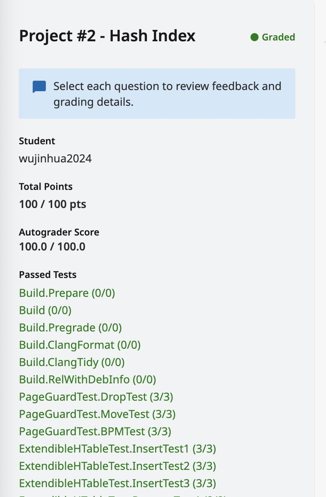

# Cmu15445 Extendible Hash Index


## Extendible Hash Index
在此编程项目中，将使用**可扩展哈希**的变体作为哈希方案，在数据库系统中实现磁盘支持的哈希索引。

下图显示了一个可扩展哈希表，其中`header`页最大深度为 2，`directory`页最大深度为 2，存储`bucket`页最多包含两个条目。值被省略，并且**键的哈希值**显示在`bucket`页面中，而不是键本身。


该索引提供快速数据检索，无需搜索数据库表中的每一行，从而实现快速随机查找。实现应该支持线程安全的**搜索**、**插入**和**删除**（包括**增长**/**收缩目录和拆分**/**合并桶**）。

## Read/Write Page Guards
在`Buffer Pool Manager`中， `FetchPage`和`NewPage`函数返回指向已固定页面的指针。固定机制确保页面不会被逐出，直到页面上不再有任何读写操作。为了表明内存中不再需要该页，程序员必须手动调用`UnpinPage`。

另一方面，如果程序员忘记调用`UnpinPage` ，该页将永远不会被从缓冲池中逐出。由于缓冲池实际上以较少数量的帧运行，因此将有更多的页面进出磁盘的交换。不仅性能受到影响，而且错误也很难被发现。

所以第一个任务将实现`BasicPageGuard` ，它存储指向`BufferPoolManager`和`Page`对象的指针。页面防护确保一旦超出范围，就会在相应的`Page`对象上调用`UnpinPage` 。请注意，它仍然应该公开一个方法，供程序员手动取消固定页面。

由于`BasicPageGuard`隐藏了底层`Page`指针，因此它还可以提供只读/写入数据 API，这些 API 提供编译时检查，以确保为每个用例正确设置`is_dirty`标志。

在`Page`类中，有用于多线程保护的`latch`方法。与取消固定页面类似，程序员可能会忘记在使用页面后解锁页面。为了缓解这个问题，您将实现`ReadPageGuard`和`WritePageGuard`一旦页面超出范围，它们就会自动解锁页面。

需要为所有`BasicPageGuard` 、 `ReadPageGuard`和`WritePageGuard`实现以下函数。

###  **`PageGuard(PageGuard &&that)`**
> **移动构造函数**。拷贝构造函数和拷贝赋值的目的是将一个对象**复制**到另一个对象，而**移动构造函数**和**移动赋值**的目的是将**资源的所有权从一个对象转移到另一个对象**(这通常比复制成本低得多)。实现拷贝语义时需要使用**const类型的左值引用**作为形参，而实现移动语义时，需要使用**非const的右值**形参。

1. 转移资源所有权（之后释放原来对象对资源的管理）。

```c++
BasicPageGuard::BasicPageGuard(BasicPageGuard &&that) noexcept
    : bpm_(that.bpm_), page_(that.page_), is_dirty_(that.is_dirty_) {
  that.page_ = nullptr;
  that.bpm_ = nullptr;
  that.is_dirty_ = false;
}
```

###  **`operator=(PageGuard &&that)`**
> **移动赋值运算符**。

1. 自我赋值检查。
2. 释放被赋值对象当前持有的资源。
3. 转移资源所有权。

```c++
auto BasicPageGuard::operator=(BasicPageGuard &&that) noexcept -> BasicPageGuard & {
  if (&that == this) {
    return *this;
  }
  Drop();

  bpm_ = that.bpm_;
  page_ = that.page_;
  is_dirty_ = that.is_dirty_;

  that.page_ = nullptr;
  that.bpm_ = nullptr;
  that.is_dirty_ = false;
  return *this;
}
```


###  **`Drop()`**
> Unpin and/or unlatch.

1. 如果`bpm_`和`page_`不为nullptr，执行`bpm_->UnpinPage`。
1. `bpm_`和`page_`置为nullptr。

###  **`~PageGuard()`**
> 析构函数。
1. 调用`Drop()`。

还需要为`BasicPageGuard`实现以下升级功能。这些函数需要保证受保护的页面在升级过程中不会被从缓冲池中逐出。

###  **`UpgradeRead()`**
> 升级到`ReadPageGuard`。

1. 如果page_不等于nullptr，上读锁RLatch()。
1. 当前资源所有权转移给`ReadPageGuard`，将它返回。

###  **`UpgradeWrite()`**
> 升级到`WritePageGuard`。

1. 如果page_不等于nullptr，上写锁WLatch()。
1. 当前资源所有权转移给`WritePageGuard`，将它返回。

使用新的页面防护，在`BufferPoolManager`中实现以下包装器。

###  **`FetchPageBasic(page_id_t page_id)`**
1. 调用`FetchPage`获取`page`，用`this`和`page`构造`BasicPageGuard`返回。
###  **`FetchPageRead(page_id_t page_id)`**
1. 调用`FetchPage`获取`page`，若不为nullptr则上读锁`RLatch()`。
1. 用`this`和`page`构造`ReadPageGuard`返回。
###  **`FetchPageWrite(page_id_t page_id)`**
1. 调用`FetchPage`获取`page`，若不为nullptr则上写锁`WLatch()`。
1. 用`this`和`page`构造`WritePageGuard`返回。
###  **`NewPageGuarded(page_id_t *page_id)`**
1. 调用`NewPage`获取`page`，用`this`和`page`构造`BasicPageGuard`返回。

## Extendible Hash Table Pages
每个可扩展哈希表头/目录/桶页对应于缓冲池取出的内存页的内容（即`data_`部分）。每次读取或写入页面时，必须首先从缓冲池中获取页面（使用其唯一的`page_id` ），重新解释将其转换为相应的类型，并在读取或写入页面后取消固定该页面。也就是利用任务1的`PageGuard` API来实现这个目标。
### Header Page
标头页位于基于磁盘的可扩展哈希表的第一级，并且哈希表只有一个标头页。它存储指向目录页面的逻辑子指针。你可以把它想象成一个静态的一级目录页面。它有两个字段：
- *directory_page_ids_*：`目录页面` id 的数组
- *bucket_size_*：`标题页`可以处理的最大深度，也就是最开始图中的header(`2`)。

需要实现：

1. `Init(uint32_t max_depth)`：赋值max_depth_，directory_page_ids_数组中的值都置为INVALID_PAGE_ID。
1. `HashToDirectoryIndex(uint32_t hash)`：把hash右移32-max_depth_位，保留最高max_depth_位返回。
1. `GetDirectoryPageId(uint32_t directory_idx)`

1. `SetDirectoryPageId(uint32_t directory_idx, page_id_t   directory_page_id)`
1. `MaxSize()`：左移max_depth_位，2的max_depth次方。

### Directory Page
目录页位于基于磁盘的可扩展哈希表的第二层。它们中的每一个都存储指向桶页面的逻辑子指针，以及用于处理桶映射和动态目录增长和收缩的元数据。目录页面有以下字段：
- *max_depth_*：`标题页`可以处理的最大深度，对应图中directory(2/`2`)。
- *global_depth_*：当前`目录`全局深度，对应图中directory(`2`/2)。
- *local_depths_*：`桶页面`局部深度的数组，对应图中directory下面表格的第二列，**表示最后几位相同就在同一个桶**。例如，图中00和10对应的局部深度为1，他俩最后一位相同，所以在同一个桶，但01和11的局部深度为2，他俩就不在同一个桶。
- *bucket_page_ids_*：`桶页面`id的数组

部分需要实现的：
1. `Init(uint32_t max_depth)`：赋值max_depth_，local_depths_数组中的值都值为0，bucket_page_ids_数组中的值都置为INVALID_PAGE_ID。
1. `HashToBucketIndex(uint32_t hash)`：用**与运算**取hash最后global_depth_位。
1. `GetSplitImageIndex(uint32_t bucket_idx)`：可以理解为计算兄弟桶的id，将该bucket_id的最高位反转得到的值返回。
```c++
return bucket_idx + (1 << (global_depth_ - 1));
```

4. `IncrGlobalDepth()`：首先如果已经等于max_depth_，直接return。将目录增大小扩大一倍，操作相当于把现在的内容复制一遍给新增的那部分：
```c++
void ExtendibleHTableDirectoryPage::IncrGlobalDepth() {
  if (global_depth_ >= max_depth_) {
    return;
  }
  // double the size of the directory
  for (int i = 0; i < 1 << global_depth_; i++) {
    bucket_page_ids_[(1 << global_depth_) + i] = bucket_page_ids_[i];
    local_depths_[(1 << global_depth_) + i] = local_depths_[i];
  }
  global_depth_++;
}
```
5. `DecrGlobalDepth()`：若已经等于0，直接return。否则减一。
1. `CanShrink()`：GD等于零返回false。检查所有LD < GD。
1. `IncrLocalDepth`和`DecrLocalDepth`：检查大小后直接增或减。


### Bucket Page
桶页面位于基于磁盘的可扩展哈希表的第三层。它们是实际存储键值对的。有以下字段：
- *size_*：桶中保存的键值对的数量。
- *max_size_*：桶可以处理的最大键值对数量。
- *array_*：大小为桶页面局部深度的数组，存储键值对数据。

部分需要实现的：
1. `Lookup(const K &key, V &value, const KC &cmp)`：查找key，如果找到了把key(array[i],first)对应的值(array[i].second)赋给value，返回true。
1. `Insert(const K &key, const V &value, const KC &cmp)`：查找key，如果已经存在，返回false。如果key不存在，则插入到数组最后，size增加，返回true。
1. `Remove(const K &key, const KC &cmp)`：查找key，找到了就array_中后面的元素往前移一位，size减少，返回true。没找到返回false。

## Extendible Hashing Implementation
实现对**插入**、**搜索**和**删除**的支持。要求要实现**桶拆分/合并**和**目录增长/收缩**。先了解一下实现关键点：
- *Empty Table*：第一次创建一个空哈希表时，它应该只有一个唯一的`Header Page`，`Directory pages` 和 `bucket pages`按需创建。
- *Header Indexing*：通过前面的部分应该已经明白了，使用**最高有效位**来索引标题页中的`directory_page_ids_`数组。
- *Directory Indexing*：使用**最低有效位**来索引目录页中的`bucket_page_ids_`数组。
- *Bucket Splitting*：如果没有空间插入，则必须**分裂桶**。
- *Bucket Merging*：当桶变空的时候必须尝试**合并**。有一些方法可以通过检查桶及其分割映像的占用情况来更积极地进行合并，但这些昂贵的检查和额外的合并可能会增加抖动。这里为了使事情相对简单，用以下规则：
    
    1. 只能合并空桶。
    1. 仅当其分割图像具有相同的局部深度时，桶才能与其分割图像合并。
    1. 如果合并桶的**新分割镜像**为空，则应继续**递归**合并。

- *Directory Growing*：意思就是目录会不断增长。
- *Directory Shrinking*：仅当每个桶的局部深度严格小于目录的全局深度时才收缩目录。

### **`DiskExtendibleHashTable`**
> 构造函数
1. 主要是把传入的参数都赋值，然后用`NewPageGuarded`创建一个page guard，再用模版函数转换为`ExtendibleHTableHeaderPage`，执行init。
```c++
  auto header_guard = bpm->NewPageGuarded(&header_page_id_);
  auto header_page = header_guard.template AsMut<ExtendibleHTableHeaderPage>();
  header_page->Init(header_max_depth_);
```
### **`GetValue`**
> auto DiskExtendibleHashTable<K, V, KC>::GetValue(const K &key, std::vector<V> *result, Transaction *transaction) const -> bool

1. 从标头页开始搜索：利用`FetchPageRead`获取`header_guard`，同样的方式转换为`header_page`，用`Hash`函数处理key得到hash值，然后用`HashToDirectoryIndex`处理得到`dir_index`，即可找到目录页。这里就可以`Drop`掉`header_guard`了。
1. 若得到的目录页的`PageId`为INVALID_PAGE_ID，则返回false。否则获取该目录页，`HashToBucketIndex`得到桶的索引。接着等到成功获取到桶页面切不为INVALID_PAGE_ID的时候再`Drop`掉`dir_guard`。
1. 最后就可以在桶里找了，用桶的`LookUp`函数搜索，找到了就`push_back`到`result`中，`Drop`掉`bucket_guard`，返回true。没找到就返回false。

### **`SplitBucket`**
> auto DiskExtendibleHashTable<K, V, KC>::SplitBucket(ExtendibleHTableDirectoryPage *directory, ExtendibleHTableBucketPage<K, V, KC> *bucket, uint32_t bucket_idx) -> bool

1. New一个新的页面作为新的桶页，并升级为`WritePageGuard`，如果得到的`PageId`为INVALID_PAGE_ID，说明分配失败，直接return false。
```c++
WritePageGuard split_bucket_guard = bpm_->NewPageGuarded(&split_page_id).UpgradeWrite();
```

2. 得到分裂的新桶page，执行`Init`，因为它就是传入的那个`bucket`（**执行分裂前该桶已经增加过LD了**）的兄弟，所以它在目录中的索引就是`GetSplitImageIndex(bucket_idx)`，LD也与之相同，所以目录需要对新桶执行`SetBucketPageId`和`SetLocalDepth`。
1. 由于桶的分裂，LD增加，使得之前存放的第一个桶里的内容需要拿出来**重新分配**到这两个桶里。用一个`vector`记录下第一个桶里的所有键值对，然后清空该桶，再根据每个键的最低有效位来选择放到哪个桶里。

### **`Insert`**
> auto DiskExtendibleHashTable<K, V, KC>::Insert(const K &key, const V &value, Transaction *transaction) -> bool

1. 先执行`GetValue(key, &v, transaction)`，若找到了，说明键已存在，直接返回false。
1. 同样从标头页开始找，区别就是这里用的是`FetchPageWrite`，因为涉及到写。通过`hash_key`在标头页中得到`dir_page_id`。
1. 如果`dir_page_id`等于INVALID_PAGE_ID，说明目录页不存在，需要新分配目录页，并初始化，我们另起一个函数`InsertToNewDirectory`来处理，在下面给出。否则，Drop掉header_guard，获取目录页，根据目录页和`hash_key`得到桶的`bucket_page_id`。因为目录页之后会写，不着急Drop。
1. 同理，如果`bucket_page_id`等于INVALID_PAGE_ID，另起一个函数`InsertToNewBucket`来处理。否则，拿到桶页，用桶页的`Insert`函数插入，如果成功就返回true。
1. 如果失败说明桶已满，需要**分裂桶**。先检查LD已经等于GD，如果是，再检查GD是否大于等于MD，如果不是，可以`IncrGlobalDepth`，如果也是，说明满满的了，分不了，返回false。然后就可以增加这个桶的LD了，同时增加它兄弟的LD(例如最开始图中的00和10，要加一起加)。
1. 执行到这里，就可以开始分裂了`SplitBucket`，分裂失败就返回false，否则Drop掉`bucket_guard`和`dir_guard`，然后递归`return Insert(..)`。

```c++
//  这里两个函数其实主要是在新建有效页，让对应的索引指向有效页面，最后还是要调用Insert来重新插入。 
template <typename K, typename V, typename KC>
auto DiskExtendibleHashTable<K, V, KC>::InsertToNewDirectory(ExtendibleHTableHeaderPage *header, uint32_t directory_idx,
                                                             uint32_t hash, const K &key, const V &value) -> bool {
  page_id_t dir_page_id = INVALID_PAGE_ID;
  // allocate a new directory page
  WritePageGuard dir_guard = bpm_->NewPageGuarded(&dir_page_id).UpgradeWrite();
  auto dir_page = dir_guard.AsMut<ExtendibleHTableDirectoryPage>();
  dir_page->Init(directory_max_depth_);
  header->SetDirectoryPageId(directory_idx, dir_page_id);
  auto bucket_idx = dir_page->HashToBucketIndex(hash);
  return InsertToNewBucket(dir_page, bucket_idx, key, value);
}

template <typename K, typename V, typename KC>
auto DiskExtendibleHashTable<K, V, KC>::InsertToNewBucket(ExtendibleHTableDirectoryPage *directory, uint32_t bucket_idx,
                                                          const K &key, const V &value) -> bool {
  page_id_t bucket_page_id = INVALID_PAGE_ID;
  // allocate a new bucket page
  WritePageGuard bucket_guard = bpm_->NewPageGuarded(&bucket_page_id).UpgradeWrite();
  auto bucket_page = bucket_guard.AsMut<ExtendibleHTableBucketPage<K, V, KC>>();
  bucket_page->Init(bucket_max_size_);
  directory->SetBucketPageId(bucket_idx, bucket_page_id);
  return bucket_page->Insert(key, value, cmp_);
}
```

### **`Remove`**
> auto DiskExtendibleHashTable<K, V, KC>::Remove(const K &key, Transaction *transaction) -> bool

1. 同样用`FetchPageWrite`获取标头页，然后根据`hash_key`得到目录页的`dir_page_id`，`Drop`掉`header_guard`。如果得到的是INVALID_PAGE_ID，说明目录页不存在，直接return false。
1. 一样的操作得到桶页，如果桶页`PageId`为INVALID_PAGE_ID，直接return false。否则用桶页执行`Remove`，此时`Drop`掉`bucket_guard`。如果Remove失败，返回false。
1. 如果`Remove`成功，开始检测是否需要合并。一个大循环`while(LD > 0)`，内部先获取该桶的兄弟桶，然后判断**如果俩兄弟LD不一样 or 两个都不是空桶，直接`break`出来**。否则，这轮循环需要合并：`bpm_->DeletePage`掉那个空桶，LD减1，更新目录。
1. 上一个循环结束后，合并完成。这里再一个循环，判断是否`CanShrink()`，如果可以就直接目录`DecrGlobalDepth()`，直到不能缩为止。`Drop`掉`dir_guard`。返回true。

## Concurrency Control
多线程并发控制。注意实现过程中`Fetch`和`Drop`的时机。


