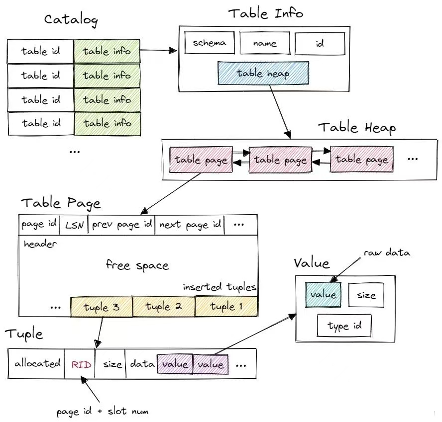

# Cmu15445 Query Execution


# Query Execution

在这次项目中，将实现允许 BusTub 执行查询的组件。具体是创建执行 SQL 查询的运算符执行程序，并实施优化器规则来转换查询计划。

BusTub的架构如下：


BusTub支持`EXPLAIN`命令打印查询的执行计划，比如：


1. `EXPLAIN`的结果中展示了查询处理层的转换过程。该语句首先有Parser和Binder处理，后者生成表示查询的抽象语法树（AST）。在这个例子中，查询由 __mock_table_1 上的 `BoundSelect` 表示，该 `BoundSelect` 将检索两列（`colA` 和 `colB`）。注意Binder 会自动将原始 SQL 查询中的 `*` 字符扩展到表中的实际列。
1. 接下来，Binder AST由Planner处理，将生成适当的查询计划。这个例子中，查询计划是一个包含两个节点的树，数据从叶子流向根。

1. 之后，优化器（Optimizer）将会优化查询计划，他会删除冗余的投影。

接下里考虑一个更复杂的例子：

这里经过优化器优化后的查询计划为：


## 注意
- 在开始之前，先对`System Catalog`有一个了解。数据库维护一个**内部目录**来跟踪关于数据库的元数据。在本项目中，你将与系统编目交互，以**查询有关表、索引及其架构的信息**。
<div align="center">
     
</div>

- 对于表修改执行器（`InsertExecutor`、`UpdateExecutor`和`DeleteExecutor`），必须修改操作所针对的表的所有索引。你会发现`Catalog：：GetTableIndexes（）`函数可以查询为特定表定义的所有索引。一旦为每个表的索引创建了`IndexInfo`实例，就可以对基础索引结构调用索引修改操作。在这个项目中，将使用你在项目#2中实现的哈希表索引作为所有索引操作的底层数据结构。

- BusTub优化器是一个**基于规则**的优化器。大多数优化器规则以自底向上的方式构造优化计划。由于查询计划具有此树结构，因此在将优化器规则应用于当前计划节点之前，需要首先将规则**递归地应用于其子节点**。在每个计划节点，你应确定源计划结构是否与你尝试优化的计划结构匹配，然后检查该计划中的属性，以查看是否可以将其优化为目标优化计划结构。（**仓库中已经提供了几个优化器规则的实现，提前看一下作为参考。**）


## Access Method Executors
此次任务，将要实现对存储系统中的表进行读取和写入的执行程序,
下面将依次介绍每一个执行程序。

### SeqScan
`SeqScanPlanNode` 可以使用 `SELECT * FROM table` 语句进行规划。

`SeqScanExecutor` 迭代一个表，并一次返回一个 Tuples。
> Hint:
>- 不要输出在 `TableHeap` 中删除的元组。检查每个元组对应 `TupleMeta` 的 `is_deleted_` 字段。
>- 顺序扫描的输出是每个匹配的元组及其原始记录标识符 （`RID`） 的副本。

1. 构造函数中能赋值的赋值。**`Init()`**中获取`table_heap`（table的`oid`在`plan_`中），用`table_heap`的`MakeIterator()`创建迭代器，用迭代器遍历，记录下所有的`RID`。
1. **`Next(Tuple *tuple, RID *rid)`**。遍历记录好的RID们，对应的tuple本身和tuplemeta都可以通过table_heap获取，若meta中显示没被删除，则赋值给参数中的*tuple和*rid作为返回值。
1. 循环的判断条件注意要加上filter评估的结果转换为bool类型，若是最后一个rid也过去了就return false，否则return true。
```c++
  do {
    ...
  } while (meta.is_deleted_ ||
           (plan_->filter_predicate_ != nullptr &&
            !plan_->filter_predicate_
                 ->Evaluate(tuple, GetExecutorContext()->GetCatalog()->GetTable(plan_->GetTableOid())->schema_)
                 .GetAs<bool>()));
  return true;
```


### Insert
可以使用 `INSERT` 语句来规划 `InsertPlanNode`。请注意，你需要使用单引号来指定 `VARCHAR`值。


>`InsertExecutor`将Tuples插入表中并更新受影响的索引。它只有一个子项就是生成要插入到表中的值。`Planner`确保这些值与表有相同的架构。`Executor` 将生成一个整数类型的 Tuples 作为输出，指示已插入到表中的行数。如果有与之关联的索引，请记住在插入表时更新索引。

1. **`Init()`**，先对`child_executor_`执行初始化，然后将`has_isnerted_`设置为false，来避免**halloween problem**。（包括后面的执行器也都需要这一步）
1. **`Next(Tuple *tuple, RID *rid)`**，先判断`has_inserted`如果为true，说明已经插入过了，直接返回false。否则置为true然后开始插入。获取需要用到的`table_info`、`schema`、`indexes`，并初始化一个`count`来记录插入行数。
1. 从子执行器`child_executor_ `中逐个取出元组并插入到表中，同时更新所有的索引。利用`InsertTuple`返回得到的`new_rid`，遍历`indexes`中的每个索引类型，先用`tuple->KeyFromTuple`拿到`key`，然后用`index_->InsertEntry`更新索引。
1. 根据要求，用count构造一个tuple返回。
```c++
  std::vector<Value> result = {{TypeId::INTEGER, count}};
  *tuple = Tuple(result, &GetOutputSchema());
  return true;
```

### Update
`UpdatePlanNode` 可以使用 `UPDATE` 语句进行规划。它只有一个子项，其中包含表中要更新的记录。

> `UpdateExecutor`修改指定表中的现有元组。执行器将生成一个整数类型的元组作为输出，指示有多少行被更新。请记住更新受更新影响的任何索引。**要实现更新，首先删除受影响的元组，然后插入一个新的元组。**

1. 前两步与`insert`相同。每次从子执行器得到的元组，先删除再插入。
1. 删除的操作是`UpdateTupleMeta(TupleMeta{0, true}, *rid)`把`meta`更新一下就可以了，然后还要删除对应的索引，用`DeleteEntry`。
1. 再插入之前，先要计算表达式，得到更新后的值，然后再执行插入，与`insert`相同。
```c++
    // update: compute expressions
    std::vector<Value> new_values{};
    for (auto &expr : plan_->target_expressions_) {
      new_values.push_back(expr->Evaluate(tuple, child_executor_->GetOutputSchema()));
    }
``` 

### Delete
`DeletePlanNode`可以用一个SQL语句来规划。它正好有一个子节点，该子节点具有要从表中删除的记录。

> `DeleteExcutor`应该生成一个整数输出，表示从表中删除的行数。它还需要更新任何受影响的索引。**要删除一个元组，你需要从子执行器获取一个`RID`，并更新该元组对应的`TupleMeta`的`is_deleted_field`**。

1. 同理update的删除部分的逻辑。

### IndexScan
`IndexScanExecutor`使用散列索引进行点查找，以检索元组的`RID`。然后操作员使用这些RID在相应的表中检索它们的元组。然后它每次发出一个元组。

计划中索引对象的类型在此项目中将始终为 `HashTableIndexForTwoIntegerColumn` 。你可以安全地将其转换并存储在executor对象中：
```c++
htable_ = dynamic_cast<HashTableIndexForTwoIntegerColumn *>(index_info_->index_.get())
```

> 你可以使用散列索引进行点查找，从表堆中查找元组，并根据谓词输出正确的元组。BusTub仅支持具有单个唯一整数列的索引。我们的测试用例不会包含重复的键。因此，点查找只返回一个元组，如果它存在。不要发出已删除的元组。

1. **`Init()`**的时候，用上面说的，获取`htable_`存储在executor中。
1. **`Next()`**：利用`htable_`的`ScanKey`方法搜索，若返回结果为空，说明没有这个索引，直接返回false，否则从`table_heap`中拿到这个元组查看`meta`中的`is_deleted_`，若没被删除就正常返回。

### Optimizing SeqScan to IndexScan
> 当我们查询索引列时，使用`IndexScan`将显著提高查找性能。为此，我们需要将**过滤器下推到扫描器中**，以便我们知道在索引中查找的键。然后我们可以**直接通过索引检索值**，而不是进行全表扫描或索引扫描。

这里需要修改优化器，以便在可能的情况下将`SeqScanPlanNode`转换为`IndexScanPlanNode`。如执行`bustub> EXPLAIN (o) SELECT * FROM t1 WHERE v1 = 1;`，不应用MergeFilterScan和SeqScan as IndexScan优化器规则，计划可能如下所示：


在应用MergeFilterScan和SeqScan as IndexScan优化器规则之后，我们**可以只做一个快速的索引查找，而不是迭代整个表**。生成的计划如下所示：


1. 执行之前，递归的优化子节点。
```c++
  for (const auto &child : plan->GetChildren()) {
    optimized_children.emplace_back(OptimizeSeqScanAsIndexScan(child));
  }
  auto optimized_plan = plan->CloneWithChildren(std::move(optimized_children));
```

2. 如果`optimized_plan->GetType()`等于`PlanType::SeqScan`，开始执行优化。获取计划的谓词，如果谓词为空仍然执行顺序扫描。
1. 判断其是否为条件谓词中的等值条件`ComparisonType::Equal`，只有等值条件这里才转化为索引扫描。
1. 根据谓词的列，获取索引信息`col_index`。遍历`indexes`，如果`index_->GetKeyAttrs()`取出的列与`col_index`相同，表示存在相关索引，构建`IndexScanPlanNode`并用智能共享指针来管理，返回。


## Aggregation & Join Executors
### Aggregation
`AggregationPlanNode`用于支持以下查询:

聚合执行器为每组输入计算聚合函数。它只有一个孩子。输出架构由`group-by`列和聚合列组成。实现聚合的一个常见策略是使用哈希表，并将`group-by`列作为键。
> 在本项目中，你可以假设聚合哈希表适合内存。这意味着你不需要实现基于分区的多级策略，并且哈希表不需要由缓冲池页支持。我们提供了一个`SimpleAggregationHashTable`数据结构，它公开了一个内存中的哈希表（`std：：unordered_map`），但带有一个为计算聚合而设计的接口。这个类还公开了一个 `Iterator`类型，可用于遍历哈希表。你需要完成此类的`CombineAggregateValues`函数。

Hint中提到，聚合是***pipeline breakers***，意味着在流水线中，聚合会中断数据流处理的过程。**你会希望Init()中尽可能多地做准备工作，因为聚合往往需要看到所有相关的输入行才能正确地生成最终的结果。**


0. 在实现`aggregation`之前需要先把哈希表完善一下。主要是`CombineAggregateValues`，将**输入的聚合值与结果聚合值进行合并**：遍历所有聚合表达式。根据不同的聚合类型（如计数、求和、最小值、最大值等），对每个聚合值进行相应的操作。
1. **`Init()`**：子执行器初始化，根据plan_的信息创建`SimpleAggregationHashTable`。**遍历子执行器，将子执行器中的获取的数据插入到聚合哈希表中，不能在聚合执行器中完成，因为聚合执行器需要先从子执行器中获取所有数据，然后对这些数据进行分组和聚合操作，最后才能产生输出结果**。具体来说，对每一个元组，执行`MakeAggregateKey`和`MakeAggregateValue`获取key和value，再`InsertCombine`到AHT里。 
1. **`Next()`**：利用`Iterator`遍历AHT，如果有`groupby`的话就创建一个`vector<Value>`，先把`groupby`都依次添加进去，然后把聚合值依次添加进去，用这个`vector`构造tuple返回。`groupbys`为空，则生成一个初始的聚合值元组返回。

### NestedLoopJoin
默认情况下，DBMS将对所有连接操作使用`NestedLoopJoinPlanNode`。考虑以下示例查询：

> 你需要使用类中的**简单嵌套循环连接算法**为`NestedLoopJoinExecutor`实现**内部连接和左连接**。该操作符的输出模式是左表中的所有列，后面跟着右表中的所有列。对于外部表中的每个元组，考虑内部表中的每个元组，如果**满足连接谓词**，则发出输出元组。

左连接：返回左表中的所有记录，如果右表中没有匹配的记录，就用NULL表示。

内部连接：仅返回两个表中有匹配的结果行。

1. **`Init()`**：初始化左右两个子执行器。
1. **`Next()`**：（这里解释左连接，内部连接类似）对于每个左表中的元组，遍历右表，用谓词的`EvaluateJoin`来判断是否匹配，若匹配成功，创建一个values，把左元组每一列的值添加进去，再把右元组每一列的值添加进去，用这个values构造一个tuple，返回。
1. 若是遍历完右表没找到，则用NULL代替右元组的值。
```c++
ValueFactory::GetNullValueByType(right_executor_->GetOutputSchema().GetColumn(i).GetType());
```


## HashJoin Executor and Optimization
在开始此任务之前，你需要在任务#2中实现`NestedLoopJoinExecutor`。

### HashJoin
如果一个查询包含一个两列之间有**多个等价条件**的连接（等价条件由AND分隔），DBMS可以使用`HashJoinPlanNode`。考虑以下示例查询：

> 你需要使用类中的散列连接算法为`HashJoinExecutor`实现内部连接和左连接。与聚合一样，哈希连接的构建端是*pipeline breaker*。你需要一种方法来散列一个具有多个属性的元组，以构造一个唯一的键，参考`SimpleAggregationHashTable`。


1. **`Init()`**：初始化左右两个子执行器，遍历右表执行器，把每个元组插入到自己的哈希表里。
1. **`Next()`**：遍历左表执行器，对每个元组，通过左表的`key`，在哈希表`GetValue`到所有右表中匹配的元组，然后用和`NestedLoopJoin`中相同的操作构造tuple并返回。


### Optimizing NestedLoopJoin to HashJoin
**哈希连接**通常比**嵌套循环连接**产生更好的性能。当连接谓词是**两列之间的几个等价条件的合取**时，可以使用哈希连接算法。对于这个项目，你应该能够处理不同数量的由AND连接的等价条件。

考虑这个例子：`bustub> EXPLAIN (o) SELECT * FROM test_1 t1, test_2 t2 WHERE t1.colA = t2.colA AND t1.colB = t2.colC;`
如果不应用`NLJAsHashJoin`优化器规则，计划可能如下所示：

应用`NLJAsHashJoin`优化器规则后，将从`NestedLoopJoinPlanNode`中的单个连接谓词中提取左连接键表达式和右连接键表达式。生成的计划如下所示：


1. 先写一个单独的函数用来解析`and`表达式，并提取出左右连接键表达式：如果逻辑表达式是`and`则**递归**解析两边的表达式。接下来判断是否是=表达式，**用GetTupleIdx()区分哪个列属于哪个表后，将其添加到对应的键表达式中。**
1. 开始实现`OptimizeNLJAsHashJoin`，与之前优化器一样先对子执行器进行优化。然后检查当前`plan_`的类型是不是`PlanType::NestedLoopJoin`，是的话开始优化：获取谓词，用刚才的函数提取左右两侧键表达式，用得到的结果创建一个新的`HashJoinPlanNode`返回。

## Sort + Limit Executors + Window Functions + Top-N Optimization
在开始此任务之前，您需要在任务#1中实现`IndexScanExecutor`。如果表上有索引，查询处理层将自动选择它进行排序。在其他情况下，您需要一个特殊的排序执行器来完成此操作。

### Sort
除了`ORDERBY`属性与索引键匹配的情况外，BusTub将对所有`ORDERBY`运算符使用`SortPlanNode`。
> 此计划节点不会更改`schema`（即输出与输入`schema`相同）。您可以从`order_bys`中提取排序键，然后使用`std::sort`和自定义比较器对子对象中的所有元组进行排序。您可以假设表中的所有条目都可以容纳在内存中。

1. **`Init()`**：初始化子执行器，并创建一个Vector<Tuple>来子执行器输出的元组，使用`std::sort`排序。
```c++
  std::sort(tuples_.begin(), tuples_.end(), Comparator(&GetOutputSchema(), plan_->GetOrderBy()));
```
2.  **`Next()`**：依次输出排序后的元组。

### Limit
> `LimitExecutor`约束其子执行器的输出元组的数量。如果其子执行器生成的元组数量小于计划节点中指定的限制，则此执行器无效，并生成它接收的所有元组。

1.  **`Next()`**：每次输出的时候计数，到达`plan_->GetLimit()`后返回false。

### Top-N Optimization Rule
修改BusTub的优化器以支持转换前N个查询。考虑以下查询：

`EXPLAIN SELECT * FROM __mock_table_1 ORDER BY colA LIMIT 10;`

默认情况下，BusTub将通过以下方式执行此查询：（1）对表中的所有数据进行排序（2）获取前10个元素。**这显然是低效的，因为查询只需要最小的值**。**一个更聪明的方法是动态地跟踪到目前为止最小的10个元素**。这就是BusTub的`TopNExecutor`所做的。想想什么数据结构可以用来跟踪前n个元素，**小顶堆和大顶堆！**。

所以需要修改优化器，以支持将带有`ORDER BY` + `LIMIT`子句的查询转换为使用`TopNEutor`。

1. **`Init()`**：用优先队列创建一个堆。遍历子执行器的元组，插入堆，如果当前堆的大小超过N，则弹出一个，最后保留的即为前N个，O(n*logN)
```c++
// 使用优先队列存储topN，升序用大顶堆（每次pop出来大的），降序用小顶堆
// 元素为Tuple，底层用vector存储，比较器为Comparator
std::priority_queue<Tuple, std::vector<Tuple>, Comparator> heap(Comparator(&GetOutputSchema(), plan_->GetOrderBy()));
```

1. 对于优化器`OptimizeSortLimitAsTopN`，先判断如果`plan_`的类型是`Limit`，将其转换为`LimitPlanNode`来获取`limit_`的值，并获取`plan_`的第0个孩子，如果孩子的类型是`Sort`，就创建一个`TopNPlanNode`返回。

### Window Functions
> 一般来说，窗口函数有三个部分：`partition by`、`order by`和`window frames`。这三个功能都是可选的，因此这些功能的多种组合使窗口功能一开始令人生畏。然而，窗口函数的概念模型有助于使其更容易理解。概念模型如下：* 根据`partition by`子句中的条件分割数据。* 然后，在每个分区中，按`order by`子句排序。* 然后，在每个分区（现在已排序）中，遍历每个元组。对于每个元组，我们计算该元组的框架的边界条件。每个帧都有一个开始和结束（由窗口帧的子句指定）。窗口函数是在每个帧中的元组上计算的，我们输出在每个帧中计算的结果。


