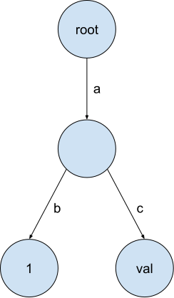

# Cmu15445 Trie


## Trie
trie 实现的是键值存储，字符串键可以映射到任何类型值。键的值存储在改键的最后一个字符的终端节点。例如将（“ab”， 1） 和 （“ac”， “val”） 插入到 trie 中。


## copy-on-write
写时复制，任何操作都不会修改原先的trie节点，而是会为修改后的数据创建新节点，并为修改后的trie返回新的根节点。这样做可以很方便的访问旧的trie，撤销操作也容易。
### 插入
例如对之前的trie插入（“ab”， 2），这里会复用原先树中的两个字节点，并创建一个新的***值节点2***，然后用他们三个来创建新的***Node2***。


然后插入（“b”， 3），创建一个新的***root***、一个新的***值节点3***并复用之前的节点。这样操作前后的内容，只要有root，就可以访问当时的完整数据。


### 删除
父节点也可以有值，例如上述trie可以插入（“a”， “abc”）。删除的时候先删除对应的节点，之后要注意的是，需要清除所有不必要的节点（即没有值且没有子节点的节点）。

### implement
#### **`Get(key)`**

1. 遍历key的每一个字符，从当前root开始，通过查看每个字符是否在`current->children_`中，没找到或者current为空直接返回nullptr，找到了就把current更新为`current->children_.at(ch)`。
1. 经过上一步骤之后，现在current就是key对应的值节点。然后利用`dynamic_cast`把它转换为`const TrieNodeWithValue<T> *`。若是转换后为nullptr，说明类型不匹配，直接返回nullptr，否则返回该节点。
```c++
auto *node{dynamic_cast<const TrieNodeWithValue<T> *>(current.get())};
```

#### **`Put(key, value)`**

1. 如果key.empty()。判断root是否有孩子，若有孩子，用孩子和传入的value创建一个new_root返回，否则直接用value创建new_root返回。
```c++
    if (root_->children_.empty()) {
      new_root = std::make_unique<TrieNodeWithValue<T>>(std::move(val_p));
    } else {
      new_root = std::make_unique<TrieNodeWithValue<T>>(root_->children_, std::move(val_p));
    }
```
2. 利用节点的`Clone()`函数，从root开始克隆，先判断root是否存在，若不存在则用`std::make_shared<TrieNode>()`新建一个TrieNode。该节点即为一会要返回的新的root。

1. 开始遍历key。每次遍历，先判断若当前字符不是key的最后一个字符，进行下述操作：在当前节点clone_current的孩子中找，若找到了则把这个孩子`Clone()`一份作为clone_current的新孩子，然后更新clone_current为这个孩子，继续往下找。若没找到该孩子，则创建一个新的TrieNode。

1. 若是遍历到最后一个字符，判断是否有对应的孩子，同理1，若有则用这个孩子的children_和传入的value创建一个TrieNodeWithValue，若没有就直接用value创建。建好了之后连上当前的`clone_current->children_[ch] = new_child`就大功告成。返回新的root。

#### **`Remove(key)`**

1. 还是先处理边界情况，若`!root_`直接返回*this。若`key.empty()`：先克隆当前root，有孩子就用孩子创建一个无值节点返回，没孩子直接返回nullptr。
1. 开始遍历key，任何一个节点没找到则直接返回*this，并把路上经过的每一个节点克隆一遍放入一个vector（或者直接用stack）中，并前后连接上。遍历完后把最后一个节点的`is_value_node`置为false。
```c++
    // clone every node in key into vec.
    clone_current = std::shared_ptr<TrieNode>(current->Clone());
    vec.back()->children_[ch] = clone_current;
    vec.push_back(clone_current);
```

3. **自底向上删除**，从vector的最后一个节点往前。若`!is_value_node`：判断若没有孩子，则erase掉该节点，否则用孩子创建一个TrieNode的无值节点替换。
1. 判断新root是否为空且`!is_value_node`，若满足则返回nullptr。否则返回新root。

### 注意
- 所有操作都不会在原始trie上修改，应该是创建一个新的trie节点并尽可能复用旧的trie节点。
- 创建新节点时将其转换为智能指针，复用节点时可以复制`std::shared_ptr<TrieNode>`，智能共享指针的增加不会复制底层数据，且会在没有人引用底层对象时自动释放对象。
- `std::move()`可以把左值转换为右值。


## Concurrent Key-Value Store
### Triestore
在拥有可在单线程环境中使用的写入时复制trie后，为多线程环境实现并发键值存储。并发键值存储应同时为多个读取器和单个写入器提供服务。

此外，如果我们从trie获得对值的引用，那么无论我们如何修改 trie，我们都应该能够访问它。Trie的`Get`函数仅返回一个指针。如果存储此值的trie节点已被删除，则指针将**悬空**。因此，在 TrieStore 中，我们返回一个`ValueGuard`，它存储对值的引用和对应于 trie 结构根的TrieNode，以便在我们存储`ValueGuard`时可以访问该值。

### implement
#### **`Get(key)`**
1. 拿到`root lock`，获取root，然后释放`root lock`。注意在持有`root lock`的时候，先不要查找trie里的值。
1. 查找trie里的值。
1. 如果找到值了，返回一个`ValueGuard`对象，它持有对值的引用和对应的root，否则返回std::nullopt。

#### **`Put(key, value)`**
1. 获取`write_lock_`，执行put。
1. 获取`root lock`，修改root_为新的root。

#### **`Remove(key)`**
1. 获取`write_lock_`，执行remove。
1. 获取`root lock`，修改root_为新的root。

## SQL String Functions
需要实现上层和下层SQL函数。这可以分2个步骤完成：
- 在 string_expression.h 中实现函数逻辑。
- 在 BusTub 中注册函数，以便 SQL 框架可以在用户执行 SQL 时以 plan_func_call.cpp 调用你的函数。
### 实现函数逻辑
简单的大小写转换，利用std::toupper和std::tolower。
### 注册函数
```c++
auto Planner::GetFuncCallFromFactory(const std::string &func_name, std::vector<AbstractExpressionRef> args)
    -> AbstractExpressionRef {
  // 1. check if the parsed function name is "lower" or "upper".
  // 2. verify the number of args (should be 1), refer to the test cases for when you should throw an `Exception`.
  // 3. return a `StringExpression` std::shared_ptr.
  if ((func_name == "lower" || func_name == "upper") && args.size() == 1) {
    return static_cast<std::shared_ptr<StringExpression>>(std::make_shared<StringExpression>(
        args[0], func_name == "lower" ? StringExpressionType::Lower : StringExpressionType::Upper));
  }
  throw Exception(fmt::format("func call {} not supported in planner yet", func_name));
}
```


