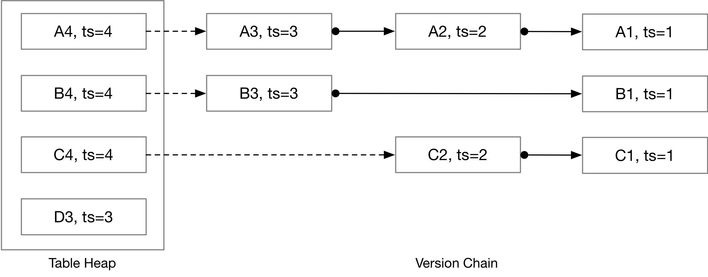
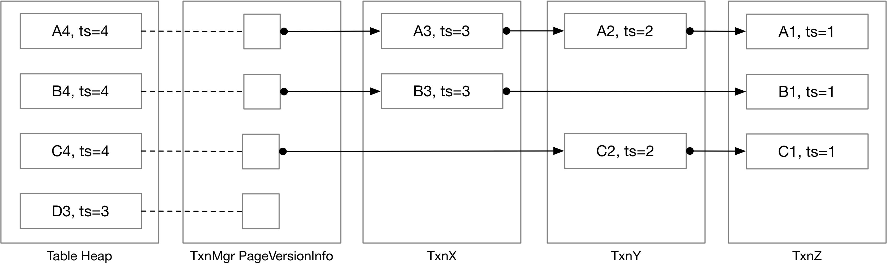
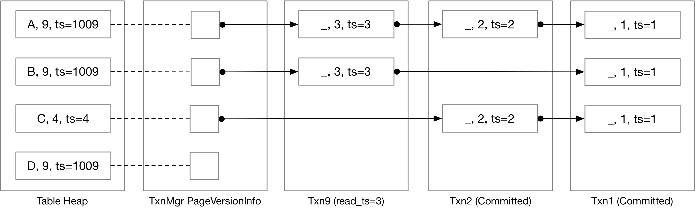
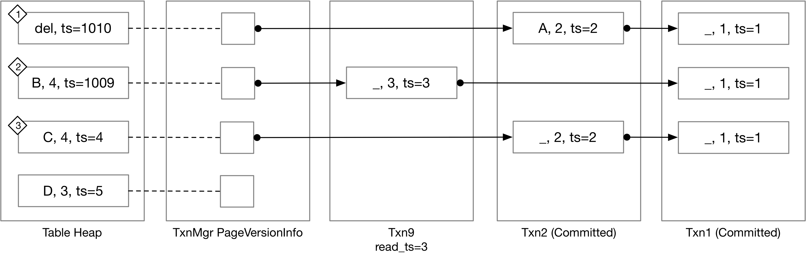
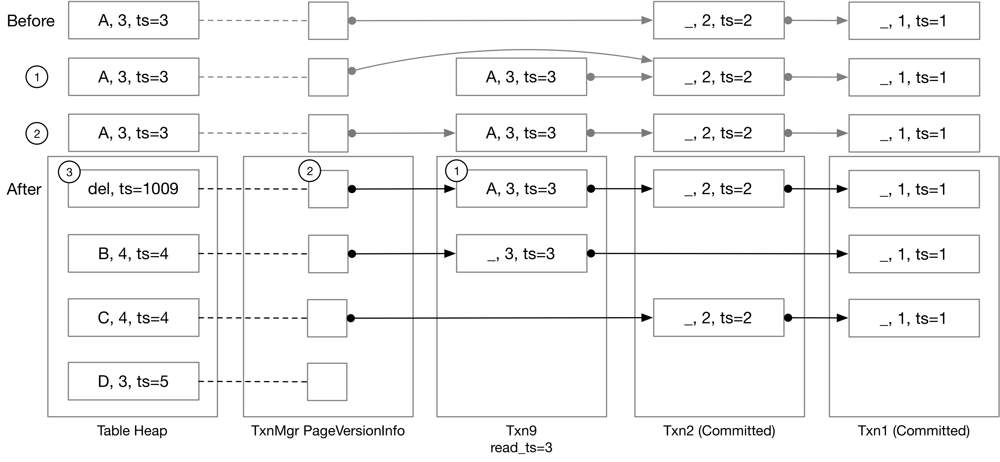
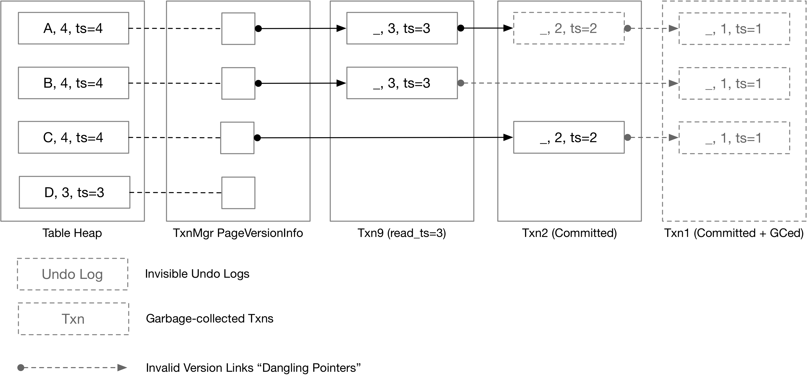

# Cmu15445 Concurrency Control


# Concurrency Control

在这个项目中，你将通过实现乐观多版本并发控制（MVOCC）来为BusTub添加事务支持。

## Timestamps

### Timestamp Allocation
> 当一个事务开始时，它将被分配一个**读时间戳**，这是最近提交的事务的提交时间戳。在事务提交时，它将被分配一个单调递增的**提交时间戳**。**读时间戳确定事务可以读取哪些数据，而提交时间戳确定事务的序列化顺序。**

比如这个例子：

提交时间戳是一个逻辑计数器，每次提交事务时**递增1**。D3元组由提交时间戳为3的事务写入。 

如果我们有一个读时间戳 = 3的事务，在这个例子中它就可以看到A3，B3，C2和D3。如果读取时间戳= 2，则会看到A2，B1，C2。当事务开始时，读取时间戳将是最近提交的事务的时间戳，因此事务将能够看到在事务开始之前提交的所有内容。**你无法读到未来的数据**。

1. 在`TransactionManager::Begin`中设置一个事务的`read_ts_`为`last_commit_ts_`，使用c++原子变量`atomic`。
```c++
txn_ref->read_ts_.store(last_commit_ts_);
```

2. 在`TransactionManager::Commit`中设置`commit_ts_`为`last_commit_ts_`+1，也使用c++原子变量`atomic`。然后`last_commit_ts_`自增1。


### Watermark
> 水印是所有正在进行的事务中最低的读时间戳。实现用尽量少的时间复杂度。

1. **定义一个map来存储每个读时间戳有多少个**。
1. `Watermark::AddTxn`中把传入的读时间戳在`map`中加1，`map`里没有就设为1。`watermark_`设置为`map.begin()->first`。
1. `Watermark::RemoveTxn`中把传入的读时间戳在`map`中减1，如果减到0了就`erase`掉。如果`map`为不空就设置为`map.begin()->first`，为空就设置为`commit_ts_`。

## Storage Format and Sequential Scan
BusTub将事务数据存储在三个地方：**表堆、事务管理器和每个事务内部**。表堆总是包含最新的数据，事务管理器“页面版本信息”存储指向下一次修改的指针，在每个事务中，我们以称为undo log的格式存储事务修改的元组。要在给定的读取时间戳检索元组，你需要
- 获取所有修改（undo logs）
- 将修改（"undo" the undo logs）应用于元组的最新版本以恢复元组的过去版本。



### Tuple Reconstruction
> 在本任务中，你将需要实现元组重构算法。你需要实现`ReconstructTuple`函数。`ReconstructTuple`接受存储在表堆中的基本元组和基本元数据，以及按它们添加到系统的时间降序排列的撤销日志列表。`ReconstructTuple`**将始终应用提供给函数的所有修改，而无需查看元数据或撤消日志中的时间戳**。

下面介绍一个重建元组的例子：

`base tuples`总是包含完整的数据，但是在`undo logs`中只包含修改过的列。`modified_fields`是一个bool向量，其长度与表模式相同，设置为true的地方表示改字段被修改。日志中的的元组字段只包含修改过的字段。同时你需要考虑`is_delete`标志来处理元组被删除的情况。

1. 判断若最后一个日志`is_deleted_`为true，说明数据最后被删了，直接返回std::nullopt。或者如果日志为空，`base tuple`显示被删除，也返回std::nullopt。
1. 遍历`undo logs`：对每个撤销日志，检查`modified_fields_`，把所有true的地方，依次记录到一个新的`vector`cols后面。根据cols，用`CopySchema`方法构造修改元组的`schema`。
1. 按照`schema`的列顺序重构元组，对每个列，判断是否在cols中，如果在就用日志中`partial tuple`的值，否则就用`base tuple`的值。最终得到重建一个日志后的元组，直到遍历完所有日志。

### Sequential Scan / Tuple Retrieval
> 在这个任务中，你需要重写Project #3中的顺序扫描执行器，以便支持基于事务的读取时间戳从过去检索数据。

顺序扫描执行器扫描表堆，**检索直到事务读取时间戳的撤销日志**，然后**重建**将用作执行器输出的原始元组。在MVCC顺序扫描执行器中需要处理3种情况：
- ***表堆中的元组是最新的数据***。可以直接返回元组，如果元组已经被删除则跳过元组。
- ***表堆中的元组包含当前事务的修改***。在BusTub中，正常的有效ts范围是0到`TXN_START_ID - 1`。若是表堆中的元组被还未提交的事务修改，那么该元组的ts会设置为`TXN_START_ID + txn_human_readable_id`，将是一个非常大的数字。所以如果发现元组就是被当前事务修改的，应该直接返回给用户，否则恢复过去版本。
- ***表堆中的元组被另一个未提交的事务修改，或者比事务读时间戳新***。在这种情况下，你将需要**重新配置版本链**，以收集读取时间戳之后的所有撤消日志，并恢复元组的过去版本。

举个例子，下面的示例中的`TXN_START_ID`将为`1000`。因此，`1009`指示元组包含`txn9`的未提交更新。

Txn9尚未提交，读取时间戳为3。在表格的txn 9中顺序扫描的结果将是：（A，9），（B，9），（C，2），（D，9）。

考虑另一个读时间戳为4的事务，该事务的顺序扫描的结果将是：（A，3），（B，3），（C，4）。

1. 在原先seqscan基础上，判断如果是当前事务修改`meta.ts_ == txn_->GetTransactionId()`或者小于事务读取时间戳`meta.ts_ <= txn_read_ts_`，即可直接返回。
1. 否则这个元组的数据要么是来自未来，要么是正在被另一个事务修改，我们需要重建该元组：获取第一个日志，若没有日志或者无效日志，则跳过，否则收集日志，知道时间戳小于等于事务读时间戳，然后重建元组。

## MVCC Executors
在本节中，你将需要实现数据修改执行器，包括插入执行器、删除执行器和更新执行器。

### Insert Executor
> 在这个项目中，你的`insert executor`实现应该与项目#3中的几乎相同。你可以简单地在表堆中创建一个新的元组。你需要正确地设置元组的元组元数据。**表堆中的时间戳应该设置为事务临时时间戳**。你还应该将RID添加到**写入集**。

### Commit
> 一次只允许一个事务进入`Commit`函数，你应该通过在事务管理器中使用`commit_mutex_`来确保这一点。在这个任务中，需要在事务管理器中用提交逻辑扩展你的`Commit`实现。

1. 获取commit锁，遍历写入集合，将`base tuples`的时间戳设置为提交时间戳。
1. 设置事务的提交状态并更新事务的提交时间戳和`last_committed_ts`


### Update and Delete Executor
> 在这个任务中，你需要实现生成撤消日志和更新表堆元组的逻辑。其中更新执行器将元组的新版本放入表堆中，删除执行器为表堆中的元组设置`is_delete`标志。

在更新或删除元组之前，你需要检查**写-写冲突**。
- 如果未提交的事务正在修改元组，则不允许其他事务修改它，如果它们这样做，则将出现写-写冲突，并且与前一个事务冲突的事务应该被中止。
- 另一种写-写冲突情况是当事务A删除元组并提交，而另一个事务B在A之前开始并删除相同的元组（写入比读ts大的元组）。

更新执行器应该实现为*pipeline breakers*：在写入任何更新之前，它应该首先扫描子执行器到本地缓冲区的所有元组。之后，它应该从本地缓冲区中提取元组，计算更新的元组，然后在表堆上执行更新。

看这个例子：

- 在情况（1）中，txn 10删除（A，2）元组并且还没有提交。Txn 9仍然可以读取元组（A，2）的旧版本，因为读取时间戳是3。在这种情况下，如果Txn 9需要更新/删除元组，则应该通过写-写冲突中止。

- 在情况（2）中，如果任何其他事务尝试更新/删除该元组，则它们将被中止。

- 在情况（3）中，存在将（C，2）更新为（C，4）的另一个事务，并且提交时间戳被设置为4。Txn 9可以读取元组（C，2）的旧版本，但是当更新/删除（C，4）元组时，它应该被中止，因为在事务读取时间戳之后发生了更新。

实现中还需要考虑**自我修改**，这应该在检查写-写冲突之前完成。如果一个元组已经被当前事务修改过，它可以自己更新/删除，你不应该把这看作是写-写冲突。如果元组是新插入的，则不需要创建撤消日志。否则，事务对于每个RID最多保留一个撤消日志。**因此，如果一个事务更新一个元组两次，你需要更新之前的撤销日志/只更新表堆。**

#### delete

1. 先检查写-写冲突，如果meta上记录的时间戳大于当前事务的读时间戳，并且不等于事务的临时时间戳，则冲突。
1. 如果是自我修改，判断是否有第一个日志，如果有，且日志和meta都未标记删除，重建一次元组，然后直接用它修改第一个日志中的元组值，并设置为标记为删除。
1. 如果不是自我修改，生成日志，日志中包含**所有字段**，并设置为标记为删除。类似**链表的插入**操作，插入到`base tuple`和第一个日志之间。


#### update

1. 与删除类似。

### Stop-the-world Garbage Collection

> 现在的代码中，一旦事务添加到事务`map`中，我们就永远不会删除它，因为具有较低读取时间戳的事务可能需要读取存储在先前提交或中止的事务中的撤销日志。在本任务中，你需要实现一个简单的垃圾收集策略，以**删除未使用的事务。**

当调用`GarbageCollection`时，会手动触发垃圾收集。在任务1中，我们已经实现了一个算法来计算水印（系统中最低的`read_ts`）。在此任务中，你将需要删除不包含任何对具有最低`read_ts`（水印）的事务可见的撤消日志的所有事务。

上面的示例说明了水印时间戳为3并且我们提交了txn1，txn2，txn9的情况。Txn1的撤销日志不再可访问，所以我们可以直接删除它。Txn2的元组（A，2）的撤销日志不可访问，**但元组（C，2）仍然可访问（因为它是第一个日志，ts为3的事务会访问到它）**，所以我们现在不能删除它。

1. 遍历事务`map`中的所有事务，再遍历每个事务中的写入集里的每个元组。
1. 对每个元组，遍历日志，**跳过第一个小于等于水印的日志**，对之后的日志，`is_deleted`设置为true。
1. 上述操作结束后，遍历事务`map`，对`COMMITTED`的事务，查看是该事务所有的`UndoLog`都标记为删除，如果是，则记录下来，遍历完后`erase`掉这些事务。

##  Primary Key Index
当创建表时指定主键时，BusTub将自动创建一个索引，其`is_primary_key`属性设置为true。一个表最多只能有一个主键索引。主键索引确保主键的唯一性。

### Index Scan, Deletes and Updates
> 在此任务中，你需要为删除和更新执行器添加索引支持。首先实现多版本索引扫描执行器，然后实现对插入、更新和删除执行器的更新和删除支持。

#### Index Scan
1. 在哈希表中`ScanKey`寻找，若返回为空则return false。
1. 不为空则判断是否是自我修改的元组或者时间戳小于当前事务的读时间戳，然后判断元组若是已删除则return false，否则获取元组。
1. 若不是第二条的情况，说明要遍历日志，将`base tuple`重构直到一个自己事务可读的日志。其中要判断日志是否存在且有效。

#### Deletes and Updates
> 一旦在索引中创建了一个条目，它将始终指向同一个RID，即使元组被标记为已删除，它也不会被删除，因此早期的事务仍然可以使用索引扫描执行器访问历史。此时，你还需要重新访问插入执行器。**考虑插入执行器插入到一个元组中的情况，该元组被删除执行器删除。你的实现应该更新已删除的元组，而不是创建新的条目**，因为索引条目一旦创建就始终指向同一个RID。你需要正确处理写-写冲突检测和唯一约束检测。

此时，你还需要考虑其他的竞争条件，若是多个事务同时更新版本链接，则只能允许其中一个继续进行，终止其他的事务。在日志信息中，有一个`in_progress`字段，表示这个元组是否已经有一个正在进行的事务。

我理解的是，多个进程竞争时，对`in_progress`的修改也不是原子操作，可能有几个进程一起获得`in_progress`，一些进程没有被正确的终止。所以事务在操作版本信息的时候，考虑对这个元组做类似上锁的操作，保证原子性的情况下获取`in_progress`字段，而阻止剩下的进程。
```c++
auto LockRID(RID rid, TransactionManager *txn_mgr) -> bool {
  auto version_link = txn_mgr->GetVersionLink(rid);

  if (version_link.has_value()) {
    return (txn_mgr->UpdateVersionLink(rid, VersionUndoLink{UndoLink{version_link->prev_}, true},
                                       [version_link](std::optional<VersionUndoLink> origin_version_link) -> bool {
                                         return origin_version_link.has_value() && !origin_version_link->in_progress_ &&
                                                origin_version_link->prev_ == version_link->prev_;
                                       }));
  }

  return txn_mgr->UpdateVersionLink(
      rid, VersionUndoLink{UndoLink{}, true},
      [](std::optional<VersionUndoLink> version_link) -> bool { return !version_link.has_value(); });
}
```

所以创建一个LockRID的函数，注意到执行`UpdateVersionLink`会传入一个`check`函数，我们定义一个`check`函数来保证，在获取`in_progress_`的过程中，没有其他进程进入，否则获取失败。

然后需要在之前的执行器中，涉及日志版本信息修改的时候，都需要先执行`LockRID`，然后才能进行修改。

but...测试中InsertConcurrency和UpdateConcurrency有时能过有时过不了，还没找到原因。
