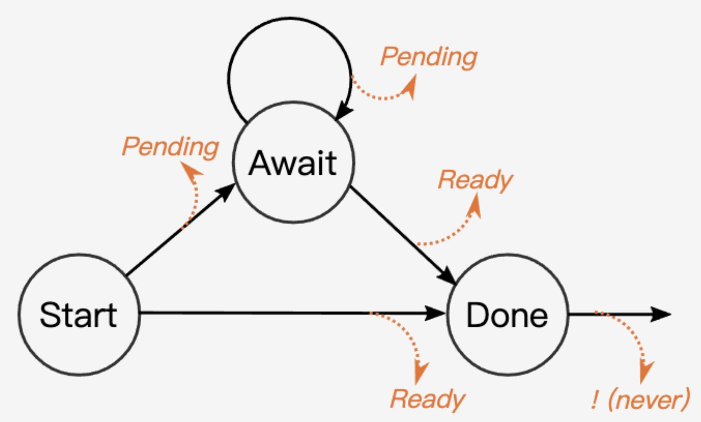

# coroutine

# 进程、线程、协程
线程是CPU调度的最小单位, 进程是资源分配的最小单位。对于线程和进程，我们可以这么理解：

* 当进程只有一个线程时，可以认为进程就等于线程。
* 当进程拥有多个线程时，这些线程会共享相同的虚拟内存和全局变量等资源。这些资源在上下文切换时是不需要修改的。
* 线程也有自己的私有数据，比如栈和寄存器等，这些在上下文切换时也是需要保存的。

协程作为用户态线程，也是轻量级的线程，用来解决高并发场景下线程切换的资源开销。协程跟线程是有区别的

* 线程/进程是内核进行调度，有 CPU 时间片的概念，进行 抢占式调度（有多种调度算法）
* 协程对内核是透明的，也就是系统并不知道有协程的存在，是完全由用户自己的程序进行调度的，因为是由用户程序自己控制，那么就很难像抢占式调度那样做到强制的 CPU 控制权切换到其他进程/线程，通常只能进行 协作式调度，需要协程自己主动把控制权转让出去之后，其他协程才能被执行到。

# GO协程的设计与原理

## GMP模型

* G（Goroutine）：用户态协程，逻辑上的计算单元
* M（Machine/OS Thread）：绑定操作系统线程，实际执行G
* P（Processor）：调度器抽象，用于调度G给M

## go func
‘’‘go
func main() {
    for i := 0; i < 10; i++ {
        go func() {
            fmt.Print(i)
        }()
    }
    time.Sleep(1 * time.Second)
}
’‘’
上述代码的运行结果为：

这段代码中开启了十个线程，可以看到并不是按顺序打印且每次不一样，这是因为这十个线程的调度时间并不固定，只有等到被调度执行的时候才会实际打印。

每个我们开启的协程都是一个计算任务，这些任务会被提交给go的**runtime**。若有多个计算任务，这些计算任务会被先暂存起来，一般的做法是放到内存的队列中等待被执行。

消费端则是一个go runtime维护的一个调度循环。调度循环简单来说，就是不断从队列中消费计算任务并执行。这里本质上就是一个**生产者-消费者**模型，实现了用户任务与调度器的解耦。

## 调度策略

为了避免多个M访问同一个队列，我们把全局队列分为多个多个本地队列，这个本地队列由P来管理。这样一来，每个M只需要去先找到一个P结构，和P结构绑定，然后执行P本地队列里的G。

上图中各个模块的作用如下：

* 全局队列：存放等待运行G
* P的本地队列：和全局队列类似，存放的也是等待运行的G，存放数量上限256个。**新建G时，G优先加入到P的本地队列，如果队列满了，则会把本地队列中的一半G移动到全局队列**
* P列表：所有的P都在程序启动时创建，保存在数组中，最多有GOMAXPROCS个，可通过runtime.GOMAXPROCS(N)修改，N表示设置的个数。
* M：每个M代表一个内核线程，操作系统调度器负责把内核线程分配到CPU的核心上执行。

**个人感觉GMP中的M就像线程池中的线程，Go runtime会动态创建和复用M，避免频繁线程切换或销毁，提升并发性能。**区别在于线程池中的线程在等待IO的时候会阻塞，但协程模型中，这个线程会在调度器的调度下运行另一个任务，IO完成后再唤醒，且任务切换的开销远小于切换线程。

调度策略： 调度器核心思想是尽可能避免频繁的创建、销毁线程，对线程进行复用以提高效率。
1. work stealing机制（窃取式）：当本线程无G可运行时，从其他线程绑定的P窃取G，而不是直接销毁线程。
2. hand off机制：当本线程M1因为G进行的系统调用阻塞时，线程释放绑定的P，把P转移给其他空闲的M0执行。
3. 抢占：一个goroutine最多占用CPU10ms，防止其他goroutine等待太久得不到执行被“饿死”。

优势： 

* goroutine是用户态线程，其创建和切换都在用户代码中完成而无需进入操作系统内核，所以其开销要远远小于系统线程的创建和切换；
* goroutine启动时默认栈大小只有2k，这在多数情况下已经够用了，即使不够用，goroutine的栈也会自动扩大，同时，如果栈太大了过于浪费它还能自动收缩，这样既没有栈溢出的风险，也不会造成栈内存空间的大量浪费。

# rust协程：tokio
通常，无栈协程在内存空间和协程上下文切换的效率更高。rust中的协程可以看作一个状态机结构体Future，一般放在堆上，并作为任务被推入一个异步任务队列等待调度器线程来调用。

## 协程运行机制
在rust中，`async fn`用来定义一个异步函数，被编译成状态机结构体Future，`tokio::spawn`会把Future推入到调度器的任务队列，实际线程从队列中取任务，调用`Future::poll`方法，返回`Poll::Ready`则任务完成，如果是`Poll::Pending`，就说明遇到了 .await 的阻塞点，注册 waker，挂起当前任务。

阻塞事件完成后，比如网络收到了响应、文件读取完成、锁可用等，Waker唤醒任务。被唤醒的任务再次 poll()，直到最终完成。
状态机的转换过程如下图：

## 调度器
Tokio采用多线程、work-stealing调度策略：
* 每个线程都有一个本地任务队列；
* 新任务随机分配到某个线程；
* 空闲线程可以从其他线程“偷”任务；
* 每个任务的 Future 是 Send + 'static，所以可以在不同线程间移动执行。

## 适用场景
I/O密集型

