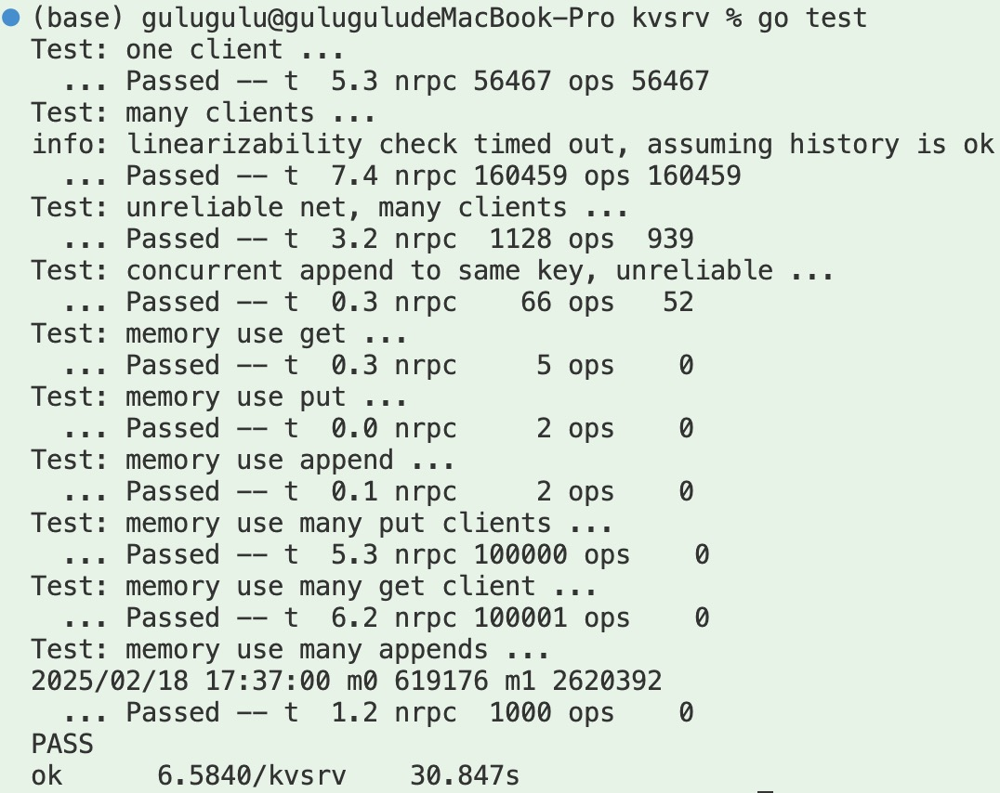

# Mit6.5840 KVServer


# Key/Value Server

本次试验中，将为一台机器构建一个键值服务器，该服务器确保即使网络故障，每个操作**也只执行一次**，且操作是**线性化**的。后面的实验将会复制这样的服务器来处理服务器崩溃。

* ***线性一致性***：最强的数据一致性保证，所有操作看起来像是按照某种全局顺序执行的，与**真实的时间顺序**一致，系统表现的像是一个单机系统，所有操作都是原子的。（分布式锁、金融系统）

* ***顺序一致性***：操作按照某种顺序执行，但不一定与真实时间一致。（多线程编程模型）

* ***最终一致性***：系统**最终**会达到一致状态，但中间可能存在不一致。（DNS 系统、分布式缓存）

* ***因果一致性***：保证**因果关系**的操作顺序，但不保证无关操作的顺序。（社交网络中的消息传递）


## 执行概述

Clients可以向KVServer发送三种不同的RPC请求：`Put(key, value)`, `Append(key, arg)`,  `Get(key)`。KVServer维护键值对的内存映射map。每个Client通过一个带有Put/Append/Get方法的`Clerk`与服务器进行对话。Clerk管理RPC与服务器的交互。

* `Put(key, value)`：设置或者替换一个特定键在map中的值。
* `Append(key, arg)`：将arg附加到键对应的值后面，并返回旧值。
* `Get(key)`：返回键对应的值，如果键不存在则返回空字符串。

提供线性一致性会使应用程序更方便，因为它是你在服务器上看到的行为，该服务器一次处理一个请求。当一个客户从服务器成功响应更新请求，则随后从其他客户端启动的读取就可以保证看到更新的效果。对于单个服务器来说，提供线性一致性也相对容易。

## 结构体定义
```go
// client.go
type Clerk struct {
	server *labrpc.ClientEnd
	requestId int64
}

// server.go
type KVServer struct {
	mu              sync.Mutex

	// Your definitions here.
	kvMap           map[string]string
	pushAppendCache map[int64]PutAppendReply
}

// Put or Append
type PutAppendArgs struct {
	Key       string
	Value     string
	RequestId int64
}

type PutAppendReply struct {
	Value   string
	ReplyId int64
}

type GetArgs struct {
	Key string
}

type GetReply struct {
	Value string
}
```

## client.go
### MakeClerk
1. 初始化Clerk，赋值server，用nrand()创建一个requestId

### Get
1. 创建`GetArgs{Key: key}`和`GetReply{}`，用来发送RPC请求
1. 循环发送RPC请求处理Get，直到响应成功时，返回`reply.Value`。

### PutAppend
put和append操作的公共部分。
1. 创建`PutAppendArgs{Key: key, Value: value, RequestId: ck.requestId}`和`PutAppendReply{}`，用来发送RPC请求。
1. 根据传入的参数`op`，循环发送RPC请求处理Put/Append，直到响应成功时，返回`reply.Value`，且requestId自增1。

## server.go
### Get
1. 获取锁，避免脏读到中间状态。
1. 读取`kvMap`对应key的值，若存在，则把值返回给`reply`，否则返回空字符串。

### Put
1. 获取锁。
1. **查看`pushAppendCache`，若存在该`requesID`，则把对应的值返回给`reply`，然后return。**
1. 否则，设置`kvMap`对应key的值，然后把该`requestId`和`reply`添加到`pushAppendCache`中。
1. 清理上一个请求的缓存。
```go
delete(kv.pushAppendCache, args.RequestId-1)
```

这里的`pushAppendCache`的作用是，如果客户端发送了`Put/Append`请求，但服务器崩溃了，那么客户端会重新发送请求，这里就可以检查`requestID`是否存在于缓存，保证每个操作只执行一次。

## Append
处理过程与Put相同，区别在于Put是直接修改对应key的值，而Appen的是把值附加到对应key的值后面。

## StartKVServer
初始化服务器的kvMap和pushAppendCache。
```go
kv.kvMap = make(map[string]string)
kv.pushAppendCache = make(map[int64]PutAppendReply)
```




