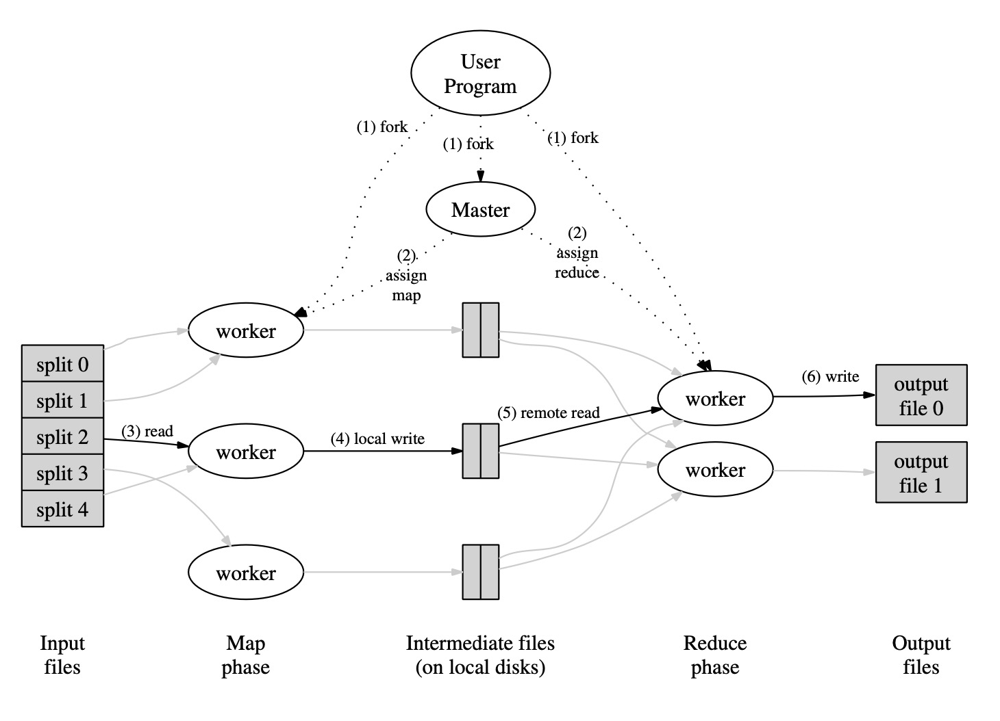
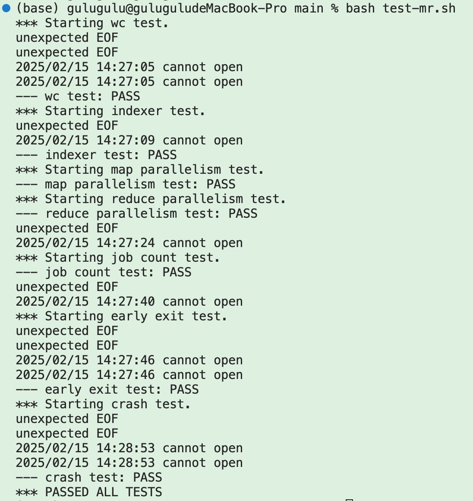

# Mit6.5840 MapReduce


# MapReduce
这次实验将构建一个MapReduce系统。需要实现一个**worker**进程，它调用应用程序**Map**和**Reduce**函数并处理阅读和写入文件，以及一个**coordinator**进程，它将任务分发给worker并处理失败的worker。

## 编程模型
计算的输入是一系列键值对，输出也是一系列键值对，可以把MapReduce的计算过程表示为两个函数：***Map***和***Reduce***。
### Map
Map由用户实现，用**一个键值对**产生一系列**中间键值对**，然后将所有具有相同Key *I*的中间键值对组合在一起并发送给Reduce函数。
### Reduce
Reduce也是由用户实现，接受一个Key *I*和一些具有这个Key *I*的值，它会合并这所有的值，产生尽可能更少数量的值。一般来说，每个Reduce过程只会产生一个或者零个输出值。
### Example
下面伪代码中，处理的问题是计算大量文档中每个单词出现的次数。
```c++
map(String key, String value):
    // key: document name
    // value: document contents
    for each word w in value:
        EmitIntermediate(w, "1");
reduce(String key, Iterator values):
    // key: a word
    // values: a list of counts
    int result = 0;
    for each v in values:
        result += ParseInt(v);
    Emit(AsString(result));
```
**map**函数根据文件名和文件内容，每次发出单词加上一个计数，**reduce**函数总和某个特定单词的所有计数。

## 执行概述
***Map***的调用是分布在多个机器上的，且输入数据被自动拆分为M个小块，每个拆分块可以在不同的机器上并行处理。***Reduce***是通过使用拆分函数（例如，*hash(key) mod R*）将中间键空间分割成R块来调用。拆分数量（R）和拆分函数由用户指定。
下图描述了MapReduce的执行过程：


1. 用户程序中的MapReduce库首先将输入文件拆分为M块，通常每块16MB到64MB（用户可以通过可选参数进行控制）。然后，它在机器集群上启动程序的许多副本。
1. 其中一个程序的副本很特别——**master**，其余的是**master**分配工作的**worker**。有M个map任务和R个reduce任务要分配。master选择闲置的worker，并为其分配一个map任务或reduce任务。
1. 被分配到map任务的**worker**会读取相应输入拆分的内容。它从输入数据中解析键值对，并将每对传递给用户定义的Map函数。Map函数生成的中间键值对在内存中缓冲。
1. 缓冲对会定期写入本地磁盘，由拆分函数分区为R个区域。本地磁盘上这些缓冲对的位置被传递回**master**，**master**负责将这些位置转发给**reduce workers**。
1. 当**master**通知**reduce workers**这些位置时，它会使用远程过程调用RPC从**map workers**的本地磁盘中读取缓冲数据。当**reduce workers**读取了所有中间数据时，它会按中间键对数据进行***排序***，以便将所有出现的同一键分组在一起。需要排序是因为通常许多不同的键映射到相同的reduce任务。如果中间数据量太大，无法放入内存中，则使用外部排序。
1. **reduce workers**迭代排序的中间数据，对于每个输入的唯一中间键，它将键和相应的中间值集传递给用户的reduce函数。Reduce函数的输出被附加到此reduce分区的最终输出文件中。
1. 当所有map任务和reduce任务都已完成时，**master**会唤醒用户程序。此时，用户程序中的MapReduce调用返回到用户代码。成功完成时，mapreduce执行的输出应该在R个文件里（每个reduce任务生成一个），通常不需要把它们合并到一起。

## 定义结构体
rpc.go
```go
type Task struct {
	TaskType int
	FileName string     //存储map任务的单个文件
	FileNames []string  //存储reduce任务的多个中间文件
	TaskId int
	ReduceNum int
}
```

coordinator.go
```go
type TaskMetaInfo struct {
	TaskAddr *Task
	state int
	BeginTime time.Time //记录开始时间，用来计算超时
}

type TaskMetaHolder struct { 
	MetaMap map[int]*TaskMetaInfo //存储所有任务信息
}

type Coordinator struct {
	State          int
	MapChan        chan *Task
	ReduceChan     chan *Task
	ReduceNum      int
	Files          []string
	taskMetaHolder TaskMetaHolder
	mu             sync.Mutex
}
```

在Coodinator中，用Go的`channal`来实现同步，保证线程安全，但仍然有部分公共资源的访问需要加锁，如`taskMetaHolder`。

## worker.go
### Worker
循环执行`GetTask()`来获取任务，若
* 任务类型为*MapTask*，则调用`DoMapTask`函数，执行完后调用`TaskDone`函数来告诉coordinator已经执行完毕。
* 任务类型为*ReduceTask*， 则调用`DoReduceTask`函数，执行完后调用`TaskDone`函数来告诉coordinator已经执行完毕。
* 任务类型为*WaitingTask*，则调用`time.Sleep(time.Second)`，等待一秒。
* 任务类型为*ExitTask*，则退出循环。

### GetTask
模仿CallExample的流程，利用RPC来调用Coordinator中的`PullTask`函数，请求一个任务。

### DoMapTask
1. 打开并读取FileName的文件，把文件名和内容传入`mapf`函数，返回一系列中间键值对。
1. 对键用哈希，把结果分类放入二维数组中。
```go
	HashKv := make([][]KeyValue, reduceNum)
	for _, kv := range(intermediate) {
		index := ihash(kv.Key) % reduceNum
		HashKv[index] = append(HashKv[index], kv)
	}
```
3. 根据实验指导中的提示，利用`json.NewEncoder`，把中间键值对存入文件中，键的哈希值相同的放在同一个文件中，文件命名方式为` "mr-tmp-" + task.TaskId + "-" + index`，每个map任务产生reduceNum个文件。***如此一来，不同index对应的中间文件里的键就不相同，分布式并行处理起来互不干扰，每个reduce worker只需获取属于自己index的那些文件来计算。***

### DoReduceTask
1. 根据task.FileNames，打开并读取多个中间文件，把所有键值对放在一个数组中，然后用sort排序（同理mrsequential.go）。
1. 输出文件命名为`"mr-out-" + task.TaskId`。
1. 遍历排序后的中间键值对，计算相同的键出现的次数，并写入输出文件中。

### TaskDone
用RPC调用Coordinator的`MarkDone`函数，通知Coordinator已经执行完毕。


## coordinator.go
### MakeCoordinator
1. 初始化`Coordinator`结构体。
1. 执行`c.MakeMapTasks`函数，生成map任务。
1. 执行`go c.CheckTimeOut()`，定期检查任务是否超时。

### (c *Coordinator) MakeMapTasks
遍历所有输入文件，每个文件生成一个map任务，并放入`c.MapChan`中，并维护`c.taskMetaHolder`信息。

### (c *Coordinator) MakeReduceTasks
1. 生成`ReduceNum`个reduce任务，并放入`c.ReduceChan`中，并维护`c.taskMetaHolder`信息。
1. 初始化task的时候，`TaskId`从`len(c.Files)+1`开始，即跟在map任务后面。
1. 初始化task的时候需要传入`FileNames`，即map任务产生的中间文件，例如最开始的一个reduce任务需要文件mr-tmp-0-0，mr-tmp-1-0，mr-tmp-2-0...筛选最后一个数字为0的中间文件。

### PullTask
供worker的`GetTask`远程调用，来分配任务给worker。
1. 由于只能所有map任务执行完之后才能进入到reduce阶段，所以这里先要check是否当前所有任务都执行完毕，若已经执行完毕，就进入下一个阶段，若下一阶段是reduce，就需要执行`c.makeReduceTasks()`，若当前已经是reduce阶段，则进入到`ALLDone`阶段。这一部分访问公共资源，需要加锁。
1. 接下来判断若当前`c.State`为`MapState`，则从`c.MapChan`中取一个任务给`*reply`，然后初始化一下`TaskMetaInfo`信息，设置任务的`state`和`BeginTime`。
1. 若当前`c.State`为`ReduceState`，则从`c.ReduceChan`中取一个任务给`*reply`，同样的方式初始化。
1. 否则返回一个`ExitTask`类型的任务，告知worker退出。

### MarkDone
访问公共资源，上锁。把`taskMetaHolder`中对应任务的`meta.state`设置为`Done`。

### CheckTimeOut
1. 执行循环，开始调用`time.Sleep`，每两秒检查一次是否有任务超时，访问公共资源，上锁。
1. 如果`c.State`为`ALLDone`，则直接返回。
1. 依次访问所有`c.taskMetaHolder.MetaMap`中的任务，如果任务超时，就停止该任务，并重新放入任务Channal中。

```go
for _, v := range c.taskMetaHolder.MetaMap {
			if v.state == Working && time.Since(v.BeginTime) > 10*time.Second {	// 超时了
				if v.TaskAddr.TaskType == MapTask {
					v.state = Waiting
					c.MapChan <- v.TaskAddr
				} else if v.TaskAddr.TaskType == ReduceTask {
					v.state = Waiting
					c.ReduceChan <- v.TaskAddr
				}
			}
		}
```

### Done
这个函数是给主函数中调用，来检查是否所有任务都执行完毕。这里只需查看`c.State`是否为`ALLDone`，若为`ALLDone`，则返回true，否则返回false。

  


