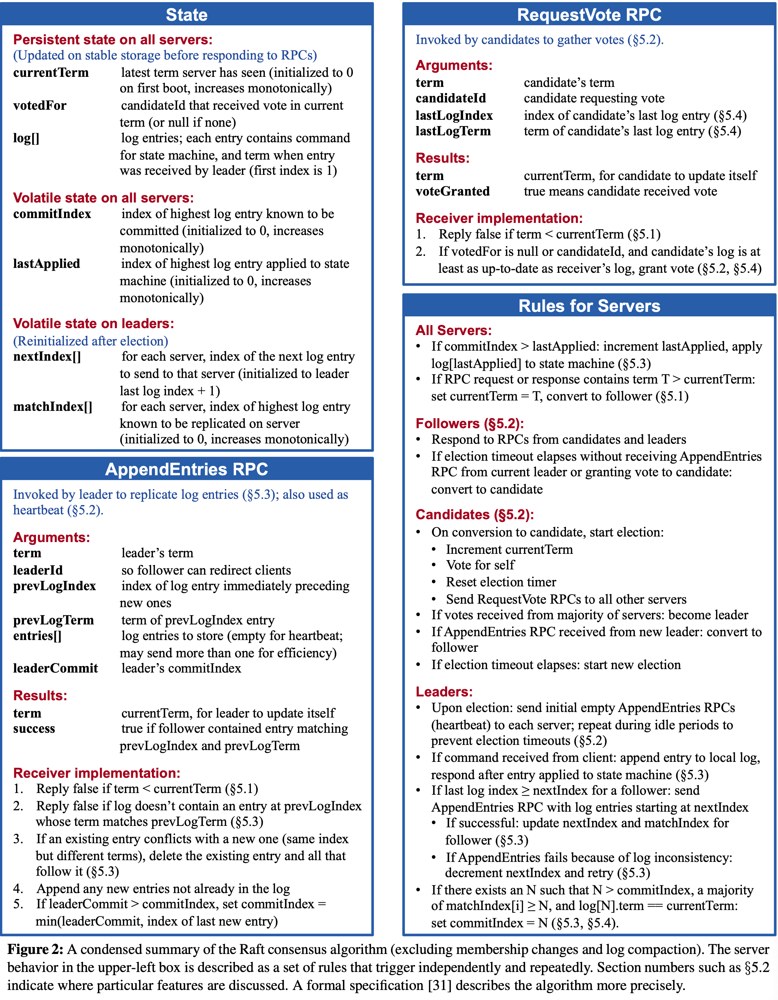

# Mit6.5840 Raft


## 3A 领导人选举
3A主要实现的是领导者选举和心跳（没有日志条目的`AppendEntries`RPC）。

基本上根据论文的图2来定义结构体。Raft结构体加上electionTimeOut bool来标记某个服务器是否超时，超时未收到心跳需要发起新一轮选举。


### RequestVote RPC
1. 上锁
1. 如果`args.Term`小于自己的`currentTerm`，说明选举人的日志不是最新的，则拒绝。
1. 如果`args.Term`等于自己的`currentTerm`且自己的`votedFor`已经投给了别人，也拒绝。
1. 先判断`args.Term`大于自己的`currentTerm`，如果是就更新`currentTerm`，重置`votedFor`和`state`。
1. 重置`electionTimeOut`为`false`，然后投票给`args.CandidateId`，并返回true。

### AppendEntries RPC
目前只需实现AppendEntries的一小部分
1. 上锁
1. 如果`args.Term`小于自己的`currentTerm`，说明选举人的日志不是最新的，则拒绝。
1. 如果`args.Term`大于自己的`currentTerm`，更新`currentTerm`，重置`votedFor`。
1. 成功，设置`state`为跟随者，重置`electionTimeOut`为`false`。

### make
这个函数中，除了初始化server的各个参数之外，开启两个goroutine，循环执行，一个给leader执行心跳，另一个判断如果超时了就重新开一轮选举。

### BroadcastHeartBeat
1. 领导给所有peer发送心跳，循环时判断如果是自己就跳过。
1. 启动一个goroutine，并发执行心跳的发送。
1. 初始化`args`和`reply`，然后调用`sendAppendEntries`，发送日志为空的心跳。
1. 此时先检查自己是否还是领导者，然后看如果回应是失败，检查reply.Term如果大于自己的`currentTerm`，说明自己过时了，直接转换为跟随者，更新`currentTerm`，重置`votedFor`和`electionTimeOut`，并返回。

### startElection
1. 构建`args`和`reply`，然后调用`sendRequestVote`，启动goroutine发送请求投票的RPC。
1. 检查自己是否还是候选者，之后如果`reply.VoteGranted`为true，计数加一，检查是否超过半数，过半了就转换为领导者，并返回。
1. 如果`reply.VoteGranted为false`，检查`reply.Term`是否大于自己的`currentTerm`，如果是，说明自己不是最新的了，转换为跟随者，重置参数。

## 3B 日志复制
3B主要实现的是日志复制，即领导者将日志复制给跟随者。

### ReequestVote RPC
这里在进行投票时，需要加上判断候选者的日志是否是最新的。

### AppendEntries RPC
1. 在上一次的基础上，检查在log中`args.PrevLogIndex`位置的日志是否匹配任期。
1. 删除`prevLogIndex`之后的日志条目，不是心跳则追加新日志条目。
1. 更新`commitIndex`，然后把日志应用到状态机，即加入到applyCh
```go
	for rf.lastApplied < rf.commitIndex {
		i := rf.lastApplied + 1
		rf.applyCh <- ApplyMsg{
			CommandValid: true,
			Command:      rf.log[i].Command,
			CommandIndex: i,
		}
		rf.lastApplied = i
	}
```

### Start
这个函数就是把用户的指令装成日志条目，append到领导者的日志中。

### BroadcastHeartBeat
1. 遍历发送的时候，判断如果该`peer`日志不是最新的就加上entries让他添加，否则就发送空entries表示心跳。
1. 成功的话，需要维护`matchIndex`和`nextIndex`。
1. 失败的话，需要加上判断，若不是因为自己不够新导致的，那就是`nextIndex`不匹配，需要减1。
1. 然后对当前任期的每个日志条目，统计每个跟随者的`matchIndex`大于等于该条目index的数量，如果大于半数，则更新`commitIndex`，并应用到状态机。

### startElection
选中领导者的时候，初始化所有nextIndex为当前日志长度，所有matchIndex为-1。

## 3C 持久性
这里主要是实现`persist()`和`readPersist()`两个函数，然后在raft.go中服务器的当前任期、日志、投票人发生变动时调用，以持久化存储状态。

### persist()
使用labgob创建编码器，将当前服务器的当前任期、日志、投票人信息编码进去，按照注释中的流程将状态编码序列话，然后用`persister`存储。

### readPersist()
用labgob创建一个解码器，解码状态，并赋值给当前服务器的当前任期、日志、投票人。

### 优化
可以优化该协议以减少被拒绝的`AppendEntries`RPC的数量。例如，当一个跟随者拒绝一个 `AppendEntries` 请求时，它可以包含冲突条目所属的任期以及该任期中它存储的第一个索引。通过这些信息，领导者可以将 nextIndex减小，从而跳过该任期内所有冲突的条目。这样，每个包含冲突条目的任期只需要一次`AppendEntries`RPC，而不是每个条目都需要一次RPC。


