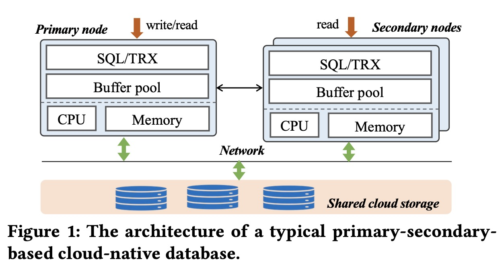
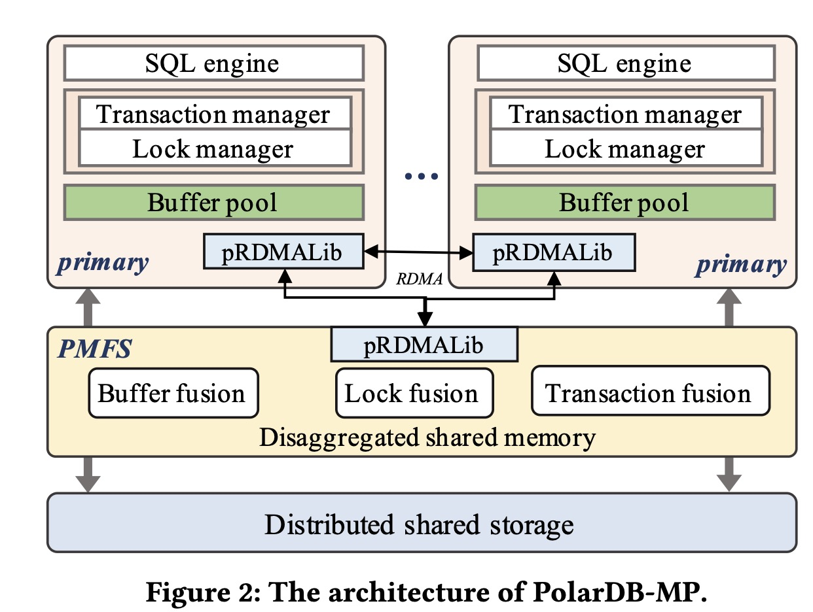
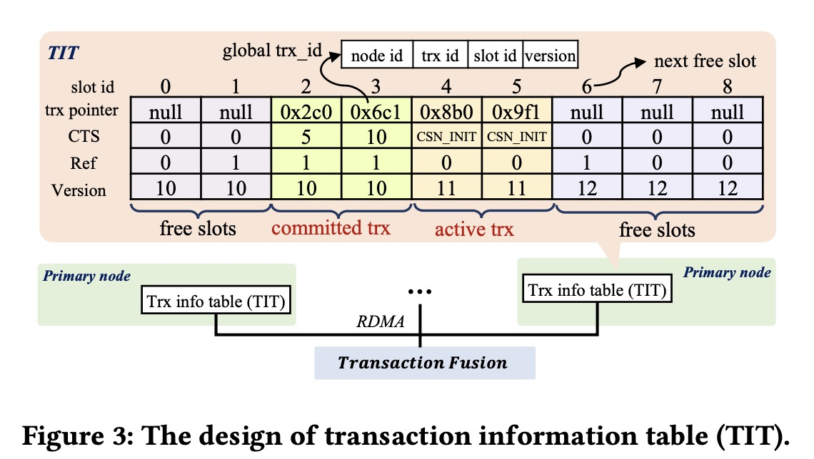
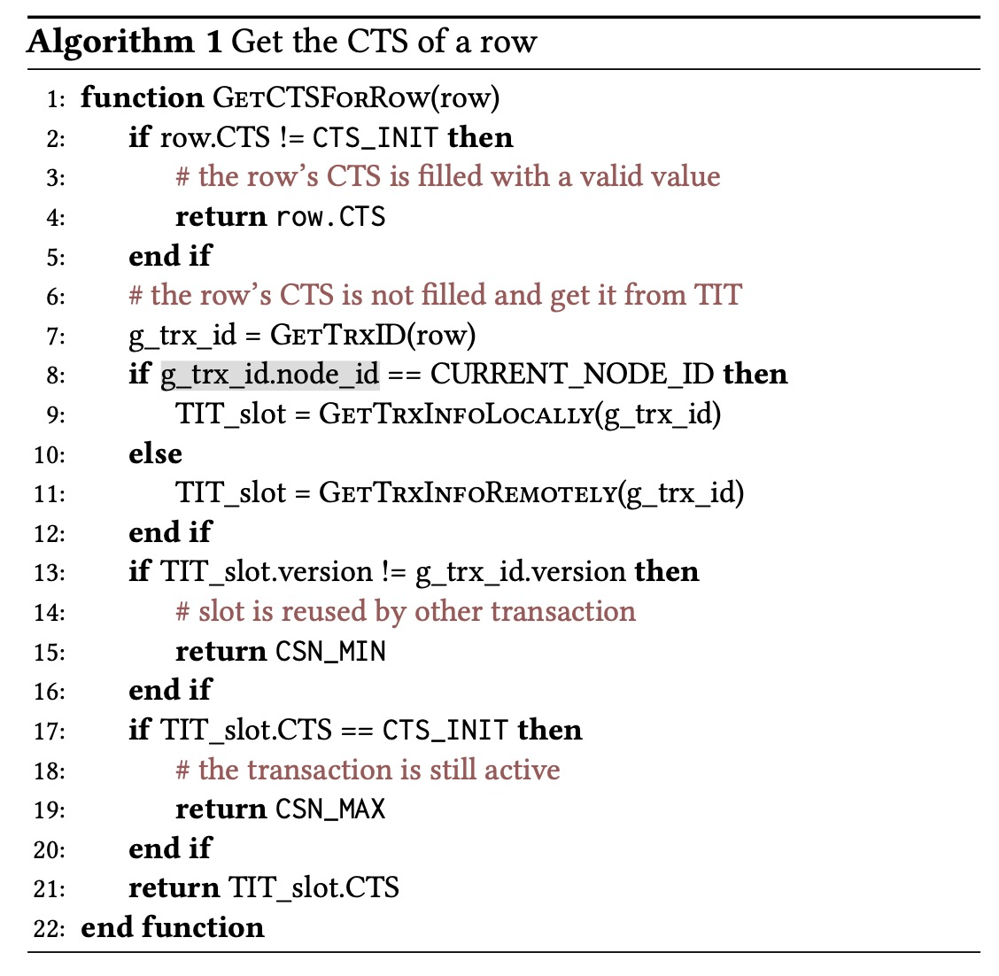
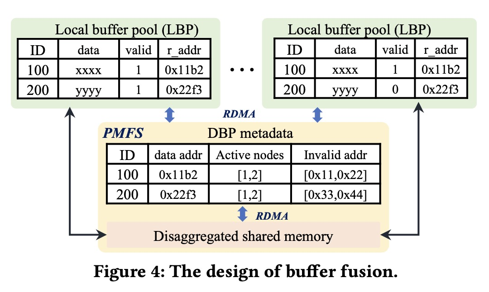
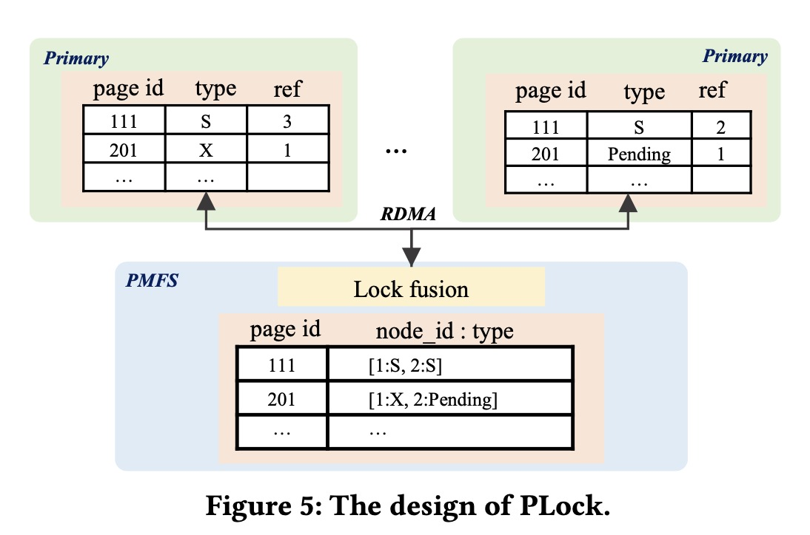
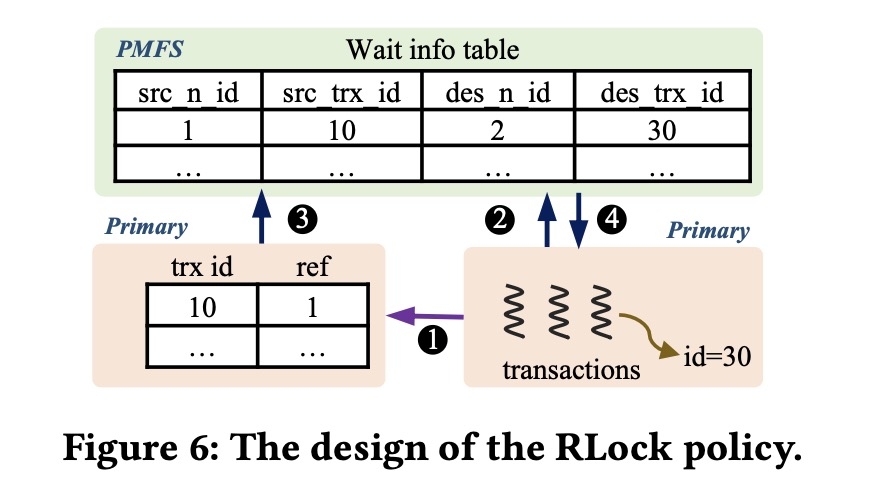

# PolarDB MP


# 摘要
传统的主从架构（**Primary- secondary**）数据库的写入能力有限，因为其使用单个主节点来写入，从节点只是同步数据。所以一些系统采用无共享架构（**shared-nothing**），实现了可扩展的多主节点集群，但带来了分布式事务的开销和性能损失。最近，出现基于共享存储（**shared-stroage**）的多主节点云原生数据库，存算分离，避免了分布式事务，但在高冲突场景下仍表现不佳，原因有冲突解决、数据融合等。

PolarDB-MP是一种*共享内存-存储*架构（**shared memory and storage**），将内存和存储从计算节点中解耦出来。每个节点可以访问所有数据，事务可以在单个节点进行而无需进行分布式事务。

* 其核心是建立在共享内存上的Polar Multi-Primary Fusion Server (PMFS)，PMFS的三大功能是：Transaction Fusion、Buffer Fusion、Lock Fussion，提供全局的事务、缓存和锁管理，这些机制都基于 RDMA（远程直接内存访问），提供极低的通信延迟。
* 引入了 LLSN（Local Logical Sequence Number），用来协调不同节点生成的写前日志（WAL），配合“定制化的恢复策略”，可以实现高效、可靠的崩溃恢复。

## 1. 介绍
主从架构不仅有写入能力瓶颈，另外在主节点挂掉时，其中一个从节点会推举当作新的主节点，这一转换过程也带来一段耗时。因此，现在对多主节点架构数据库系统的需求日益增长，它可以提高写密集型操作的扩展性，特别是对于高并发场景，同时也拥有更高的高可用性，能做到故障自动切换无缝衔接。

两个最流行的多主节点架构是shared-nothing和shared-storage。
* **shared-nothing**：（Spanner, DynamoDB, CockroachDB, PolarDB-X, Aurora Limitless, TiDB and OceanBase）整个数据库被划分成多个分区（partition），每个节点独立运行，只能访问属于它自己的那一部分数据。当有事务跨多个分区时，就必须依赖于跨分区的分布式事务机制（比如两阶段提交，2PC）来保持一致性，但这种机制通常会带来很大的额外开销。
* **shared-storage**：（IBM pureScale, Oracle RAC, AWS Aurora Multi-Master (Aurora-MM)and Huawei Taurus-MM）本质上相反，所有数据对于所有集群节点都是可访问的。Aurora-MM使用**乐观并发控制（OCC）**来处理写冲突，每个事务在开始时不加锁，先试着执行，提交时进行校验：如果有冲突，就直接回滚（abort），所以当写冲突频繁时，回滚率很高，导致性能急剧下降。Taurus-MM走的是**悲观并发控制（PCC）**路线，对共享数据加锁，防止冲突发生，但依赖页存储和日志回放来保证缓存一致性，这种同步控制和数据同步带来巨大的开销。

PolarDB-MP继承了共享存储方式，且用的是PCC，与其他数据库用日志回放和页管理器来实现节点间的数据同步不一样的是，它使用分离式共享内存（shared-memory）来实现高效率的数据同步。随着各大云厂商越来越普遍地提供RDMA网络支持，PolarDB-MP整个设计深度融合了 RDMA 技术，以此来提升性能。


## 2. 背景
### 2.1 单主节点（Single-Primary）云原生数据库
如今许多云原生数据库基于主从架构，如图。主从架构通常包含一个主节点来承担读和写请求，一个或者多个从节点只负责读请求。每个节点是一个完整的数据库实例，然而，相对于传统的完整数据库，一个显著特征是使用了分离式共享存储。共享存储保证了容错性和一致性，增加节点不需要增加额外的存储空间，与传统的主从架构中每个节点维护自己的存储不同。



缺点：
* 写密集型场景下存在严重挑战。写操作都集中在主节点，无法并行写入，成为瓶颈。从节点只是备份或用于读请求，资源利用不充分。
* 这类架构无法通过加节点（**scale out**）来提升写性能，因为所有写操作只能走 primary，增加再多从节点也帮不上忙，想要提升写能力，只能加大单机资源（**scale up**）。
* 但 scale up 又受限于机器本身的资源（CPU、内存等）。云服务商通常会“榨干”一台机器上所有资源，留给你的增长空间有限。就算迁移到更强的机器，也涉及“重启迁移”，会造成停机。
* 主从架构的另一个严重问题是故障转移慢：primary 崩了，secondary 须切换为新主 → 需要时间 → 会导致短暂不可用。

### 2.2 Shared-nothing 架构
shared-nothing 是一种常见的“横向扩展（scaling out）”架构，被广泛应用于分布式计算和分布式数据库。	避免节点之间争抢资源（资源竞争），消除单点故障。数据会按照某种方式被切分（partition）到不同节点，每个节点只访问自己的数据分区。每个节点可以并发处理自己的数据，不需要协调资源，大幅提升可扩展性。

缺点：
* 一旦有事务涉及多个分区（跨节点），就必须使用分布式事务协议（如两阶段提交）来保证 ACID。但要在多个节点间高效同步，保证事务原子性/一致性等ACID特性，是一件极具挑战性的事情。
* 系统扩容/缩容时，常常需要重新分区数据（repartitioning），重新分区通常意味着大量数据迁移、系统中断甚至性能抖动。

## 2.3 Shared-storage 架构
在 shared-storage 架构中，每个节点都可以读写整个数据库，所以需要全局协调机制 来控制事务执行顺序和数据一致性。通过全局锁管理器控制不同节点对相同数据的访问顺序，避免写冲突，但增加通信和同步成本。通过集中式时间戳服务给每个事务分配唯一时间戳，实现全局可序性。

传统系统的问题（如 Oracle RAC / IBM pureScale）
* 架构上依赖高性能专用硬件（例如 Infiniband、共享磁盘阵列）；
* 不适合云环境（弹性差、扩容慢）；

Aurora-MM 的问题（乐观控制）
* 多节点同时改同一页 → 冲突 → abort
* 应用需感知并处理死锁/回滚
* 某些 benchmark 场景下多节点还不如单节点快

Taurus-MM 的问题（悲观控制）
* 需要维持 page/page+log coherence
* 当节点请求某页数据时，必须：拉取页面（page），拉取日志（log），应用日志生成最新页面，这引入了大量存储 I/O 和 CPU 开销。

## 2.4 MVCC 和 事务隔离
MVCC使得每个数据项的多个版本同时存储。这些版本对于一个事务的可见性取决于隔离级别，在快照隔离下，每个事务会看到数据库在其启动时的一个快照，也就是说，它读取到的所有数据都是事务开始时刻的状态，在事务执行期间不会变化，从而保证了数据视图的一致性。这依赖于MVCC，这种机制可以有效隔离读写操作：读操作不会被写阻塞，写也不会影响读。这是 SI 的一个显著优势。

在shared-storage架构的**多主**数据库中，使用MVCC时，一个核心难题是：如何判断某个数据版本是否对当前事务可见。在传统方式下，跨节点判断数据版本是否可见需依赖同步的全局事务信息，开销极大。PolarDB-MP 通过 “每个节点维护本地事务信息 + RDMA 跨节点共享” 的方式，避免了中心协调，实现了高效低延迟的 MVCC 可见性判断。

## 2.5 RDMA
一个多主节点数据库集群不可避免需要不同节点间的数据同步和并发控制，使得网络成为影响性能的重要因素。好在网络技术的进步和迭代，让网络不再是瓶颈。如阿里巴巴的一个核心基础组件**RDMA**，给PolarDB-MP的实现提供了支持。利用基于RDMA的分离式共享内存，在节点之间直接传输数据页。另外，锁管理器和事务消息页通过RDMA网络传输。

# 3. PolarDB-MP 概述


**Polar Multi-Primary Fusion Server (PMFS)**是建立在分离式共享内存架构之上，它使得所有节点可以平等访问内存中的共享数据，并发处理读写请求。PMFS关键功能是管理全局的事务同步和缓冲区一致性。

1. Transaction Fusion：全局事务处理，保障 ACID + MVCC + Snapshot Isolation
* 全局 Timestamp Oracle (TSO)：为所有事务提供统一的提交顺序，保证全局一致性。TSO为每个事务分配唯一的时间戳，以确定先后顺序。
* 事务可见性管理（Snapshot Isolation）：支持基于 MVCC 的快照隔离，每个节点维护自己的本地事务状态。借助 **RDMA**，其他节点可以快速访问这些事务状态，从而判断某个数据版本是否在当前事务的快照中可见。

2. Buffer Fusion：缓存的一致性维护。
* 实现了一个分布式缓存池（Distributed Buffer Pool，DBP）
* 所有节点可以向 DBP 推送数据（push），或从 DBP 拉取数据（pull）
* 借助 RDMA + 分离式共享内存实现高性能

3. Lock Fusion：多节点的并发控制核心，支持并发访问的数据一致性和事务隔离。
* **PLock**（Page Lock）：页级锁，用于保证物理页在多节点间的一致性。
* **RLock**（Row Lock）：行级锁，用于保障事务隔离（如实现两阶段锁协议 2PL）。

在多主节点环境中，每个节点都可以独立生成 redo log（即write-ahead log, WAL）。如果没有统一的日志顺序，恢复时就无法判断每个页面的变更顺序，容易出现重放顺序错误，导致恢复失败或数据不一致。逻辑日志序列号（Logical Log Sequential Number）的作用：

* 为不同节点产生的日志赋予 逻辑顺序
* 按照数据页粒度维护 redo log 的顺序
* 这确保了页面级的日志重放是按时间顺序的，从而保证恢复的正确性

# 4. 设计和实现
## 4.1 Transaction Fusion


当一个事务进行到提交阶段，会从TSO请求一个提交时间戳**CTS**，这个CTS是逻辑自增的，维护事务的顺序性。PolarDB-MP使用了一种去中心化的方法，把事务信息分散到所有节点。每个节点保留一小部份内存来存储本地**事务信息表TIT**，节点可以通过单边RDMA来获取其他节点的事务信息。

TIT在事务管理中发挥重要作用，它对每个事务维护了四个key：
* pointer：事务对象的指针
* CTS：事务的提交时间戳
* version：标识了的一个slot中的不同事务
* ref：标志着是否有其他事务在等待这个事务释放锁

当一个事务在某节点上开始执行时，会分配一个逻辑自增的唯一ID（trx_id）。为了让所有节点能访问任何事务的元信息，PolarDB-MP 构造了一个全局唯一事务 ID：```g_trx_id = (node_id, trx_id, slot_id, version)```
通过这个ID，其他节点可以用 RDMA 远程访问目标节点上的TIT。每一行用户数据（row）增加了两个字段：
* g_trx_id：标明是哪个事务最后更新了这个行版本；
* CTS（commit timestamp）：标明该版本的提交时间；

在读取时，只需比对当前事务的 snapshot 与 row 的 g_trx_id和CTS，就能判断可见性，不需要中心协调器，不需要所有节点同步完整的事务表。一个事务提交时，若row在buffer中，会更新row的元数据中的CTS，若不在，CTS为默认值。



**判断可见性**：
1. 如果 row 上已经写了 CTS，那很好，直接判断是否小于读视图里的时间戳即可。
2. 否则，row 的 CTS 缺失，通过 g_trx_id 去 TIT 表里找。先查本地 TIT 表，如果没有就通过one-sided RDMA远程读该 node 的 TIT 表中的对应 slot。之后比较version 是否一致（否则可能误拿到别的事务的数据），如果 CTS 是有效时间戳 → 正常比较，如果不一致，说明原事务已经结束、row 肯定已经提交了，视为“谁都能看”。

* TIT回收：TIT 是内存表，slot 数有限，多事务并发会导致很快用完所有slot。Transaction Fusion 计算全局最小视图（global min CTS），广播给所有节点，节点可以安全回收CTS < global_min_CTS的slot。
* TSO优化：为了减少读事务频繁获取全局CTS的开销，利用Lamport Timestamp重用机制：请求到达时，如果最近系统拿到了一个来自未来的CTS，就可以直接复用，而不需要重新fetch。（应该是有一个之前的事务fetch的过程中，这个事务到达了，然后才拿到CTS回来，这时就可以复用）

## 4.2 Buffer fusion


Buffer Fusion是为了解决多节点共享读写数据页时的一致性问题。在多主架构（multi-primary）中，每个节点都可以修改任意一页，因此需要一个机制来：
* 保证其它节点读到的是最新的页（可见性）；
* 避免多个节点各自读写同一页产生写冲突、脏读或覆盖；
* 不靠中央协调器完成这些事情（分布式无中心）。

Buffer Fusion 的核心机制包括:
1. 每个节点有自己的 LBP（Local Buffer Pool），就是普通意义上的缓存页，但是每个页带了两个额外字段：
* valid: 当前页是不是有效（是否需要重新拉取最新）
* r_addr: 指向 DBP 中这个页的远程地址

2. 所有 LBP 共同组成 DBP（Distributed Buffer Pool），DBP 中的页版本是“最新”的，任何节点都可以从中获取。

3. 更新传播方式：Push-Based + Remote Invalidation。节点对某页进行修改后，在“合适的时机”把页 push 到 DBP，DBP 接收到新页后，会更新元数据（哪些节点有副本）利用这些节点 valid 字段的地址，通过 RDMA 把它们的副本标记为 invalid

**页访问流程**：
1. LBP 命中且valid，直接读
2. LBP 命中但invalid用 r_addr 走一侧 RDMA 从 DBP 拉取页
3. LBP 未命中，发 RPC 到 Buffer Fusion 查询页状态：
    * 如果 DBP 有页，Buffer Fusion 记录当前访问节点为“active node”（更新页的 metadata），返回页在 DBP 中的地址，访问节点使用 一侧 RDMA 去 DBP 拿页，并加载到自己的 LBP。
    * 如果 DBP 也没这个页，从 Shared Storage（比如分布式存储系统）读，加载后注册到 DBP（上传），页通过 远程写入（remote write）方式写入DBP，LBP 也缓存一份。


## 4.3 Lock fusion


用PLock保持并发一致性，PLock是一种跨节点的页级互斥机制，确保不会有两个节点同时修改一个结构页。



RLock 是跨节点的全局行级排他锁，用于在多主节点场景中保障事务级一致性。仅支持 X-lock，通过写入行内字段和 Lock Fusion 的协助机制实现高效、低通信开销的 2PL。


## 4.4 日志顺序和恢复
PolarDB-MP 继承了传统数据库中的 ARIES 风格日志系统。有Redo Log（预写日志）保证持久化，恢复提交事务修改；Undo Log用来回滚未提交的事务。每个节点本地维护日志，每个节点都有独立的 redo/undo log 文件，节点可以并行将日志写入存储系统，不需额外同步或加锁。事务提交前，必须先将 redo log 持久化 → WAL（Write-Ahead Logging）原则。

在 PolarDB-MP 的多主架构中，不同节点可以并发更新同一页，每个节点都会生成独立的 redo log。所以在恢复时，需要确保针对同一页的日志按写入顺序依次重放，而对不同页的日志，不需要统一排序，任意顺序都可。提出LLSN，不再强求全局日志排序（Global LSN），而是采用每页局部排序策略。

LLSN 的核心规则和同步机制：
1.	每个节点本地维护一个 LLSN 计数器；
2.	节点更新某页时，会将当前 LLSN 写入：
    * 页 metadata 中；
	* redo log 条目中；
3.	如果节点访问的页的 LLSN 比自己本地 LLSN 更大，就更新自己的 LLSN；
4.	每次生成新日志时，LSSN 自增，保证日志顺序性；
5.	利用 PLock 机制 保证任意时刻只有一个节点能修改某页 → 避免 LLSN 竞争。

恢复：按 LLSN 顺序 replay 同一页的 redo log，避免加载所有日志文件、占用大量内存、做全量排序）。
1.	分批次处理日志文件（chunk-based）；
2.	每轮从每个节点读取一小段日志（chunk）；
3.	在这些 chunks 中确定一个 LLSN_bound：
    * 该值以下的日志肯定是“安全可以 replay 的”；
    * 日志中 LLSN < LLSN_bound → 立即应用；
    * 日志中 LLSN ≥ LLSN_bound → 下一轮处理；


