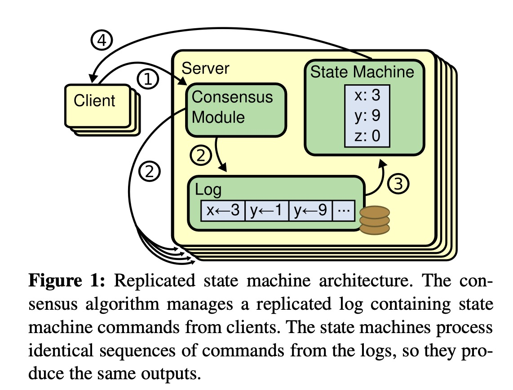
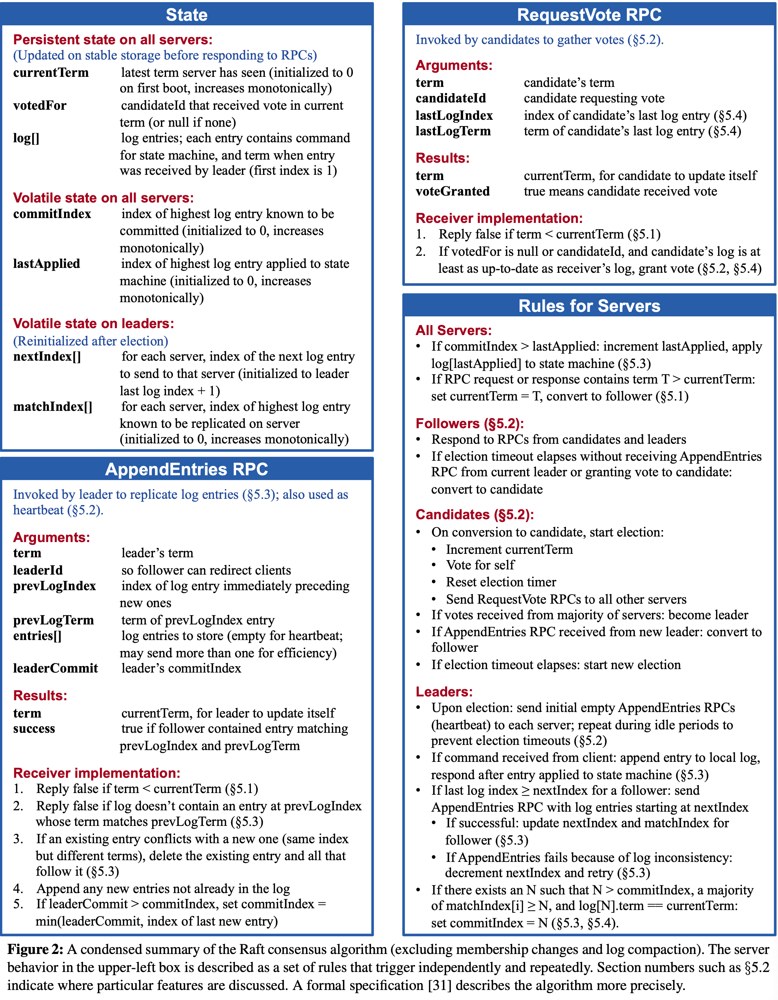
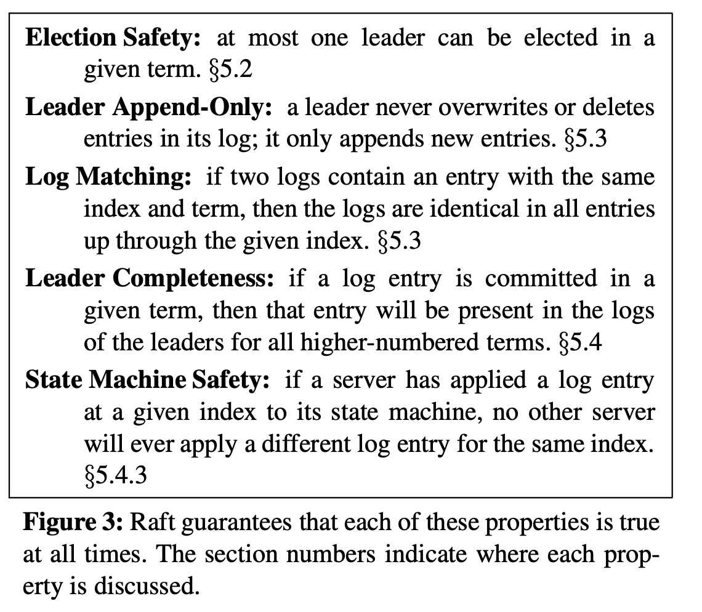
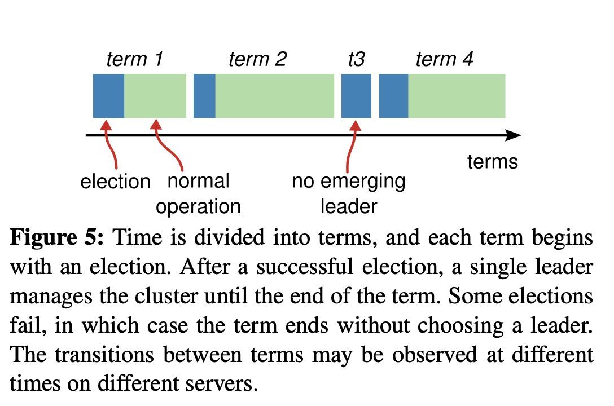
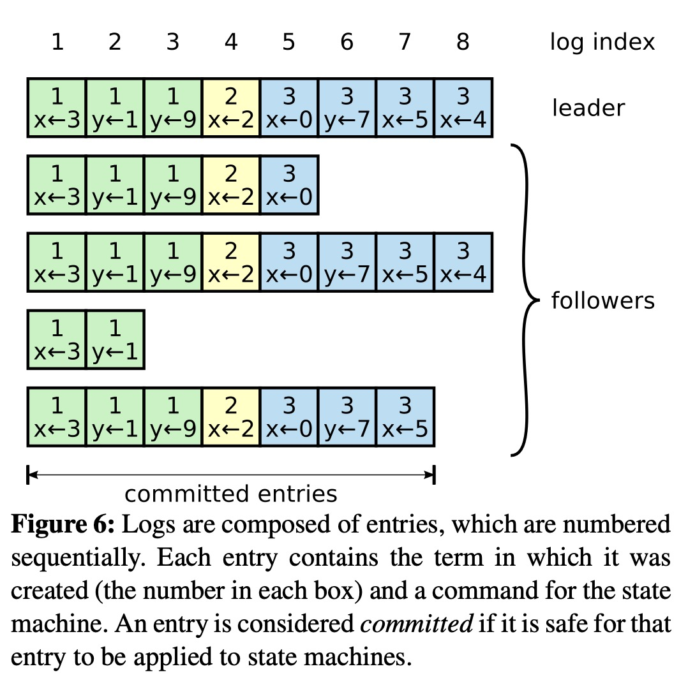
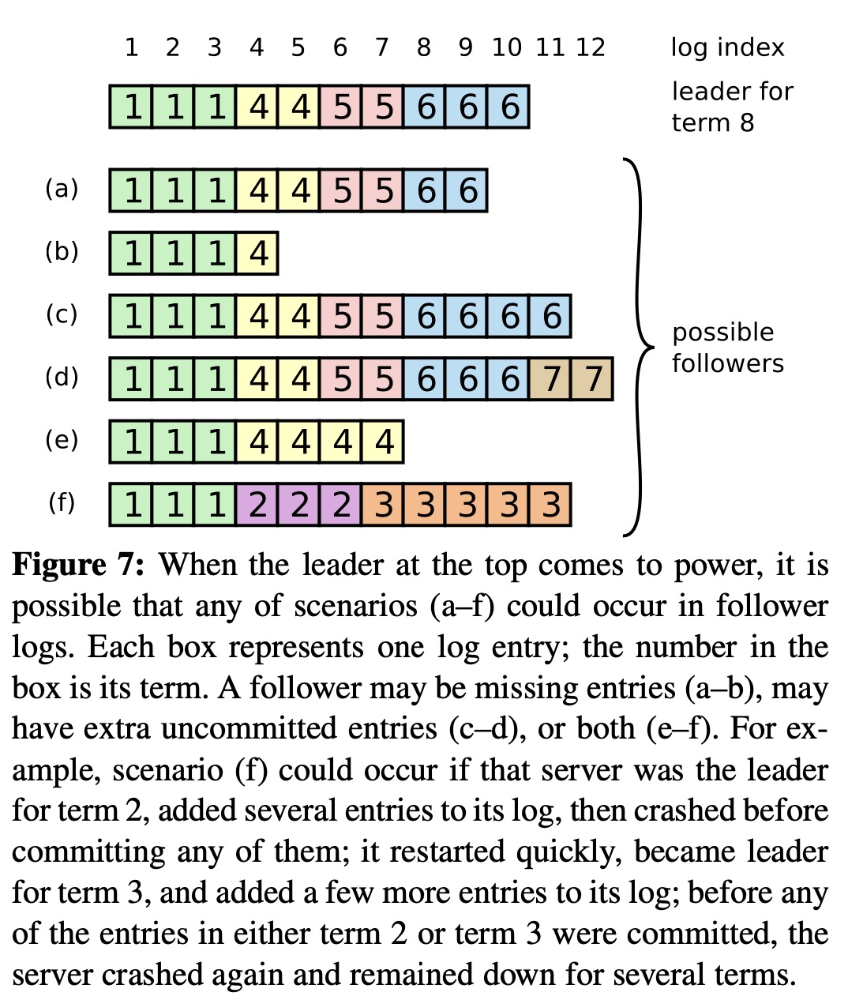

# Raft论文阅读记录

# 摘要
Raft是一种用于管理复制日志的共识算法。它的结果等价与Paxos，并且效率相当，但它的结构更容易理解。为了增强可理解性，Raft将共识的关键要素（例如领导者选举、日志复制和安全性）分离开来，并强制执行更强的一致性要求，从而减少了需要考虑的状态数量。此外，Raft 还引入了一种新的集群成员变更机制，该机制通过使用重叠的多数派来保证安全性。

## 1 介绍
论文先讲Paxos太难理解了blabla，所以想要设计一个更让人容易接受的方法，也就是Raft。Raft与其他共识算法类似，但它有几个新特征：
* **更强大的领导者**：领导力的形式更强，比如日志条目仅从领导者流向其他服务器，这简化了复制日志的管理。
* **领导者选举**：使用随机定时器来选举领导者。这只在其他共识算法所需的心跳机制增加了很小的一部分，但是却可以简单而迅速地解决冲突。
* **集群成员变更**：Raft的joint consensus方法通过在成员变更期间维护旧配置和新配置的多数派，确保了系统的高可用性和一致性，这种方法允许集群更换配置时继续正常操作，无需中断。

## 2 复制状态机
在这种方法中，一组服务器上的状态机计算相同状态的完全一致副本，即使某些服务器宕机，这些状态机仍能继续运行。状态机是用来解决分布式系统中的故障容忍问题，比如管理领导者选举，并存储那些可以拯救领导者崩溃的信息。复制状态机的例子包括Chubby和ZooKeeper。

复制状态机的实现就是用图1中的复制日志，每个服务器存储一个包含一些列指令的日志，然后所有状态机按顺序执行，每个都有相同顺序的输出结果。

保持复制日志的一致性是共识算法的职责。服务器上共识模块接收到客户的命令后添加到日志中，它与其他服务器的共识模块通信，确保即使某些服务器发生故障，每个日志最终都包含相同顺序的请求，因此这些服务器看起来形成了一台单一、可靠的状态机。

实际系统的共识算法有以下特性：
* 安全性：在所有非拜占庭条件（没有叛徒）下不会返回错误结果。
* 可用性：只要大多数服务器正常，就可以保持功能可用。
* 不依赖事件来确保日志一致性，故障的时钟和极端消息延迟只会导致可用性问题。
* 一条指令可以在集群的大多数节点对一轮RPC响应后立即完成，少数慢的节点不影响性能。

## 3 Paxos有什么问题？
1. 作者再次吐槽Paxos尤其难以理解，blabla
1. Paxos架构不适合构建实际系统，主要由于单决策分解（我就不尝试理解了）。

## 4 为了更好理解而设计
基于对Paxos的槽点，作者选择了两种普遍使用的技术：
1. 问题分解。将问题划分为可以相对独立解决、解释和理解的单独部分。
1. 通过减少需要考虑的状态数量来简化状态空间，使系统更加一致，并尽可能消除不确定性。

## 5 Raft共识算法
Raft是一种管理复制日志（如第二节讲述的形式）的算法。图2以浓缩形式总结了该算法，图3列出了该算法的关键属性。

Raft实现共识，先第一步选举一个领导者，然后将管理复制日志的全部责任交给它。领导者从客户那边接收日志，复制他们到其他服务器，然后告知这些服务器何时才能安全的把日志条目应用到状态机。拥有一个领导者可以简化复制日志的管理，比如领导者可以在不咨询其他服务器的情况下决定新条目在日志中的存放位置，并且数据以简单的方式从领导者流向其他服务器。如果领导者发生故障或与其余服务器断开连接，则选举一个新的领导者。

根据领导者方法，Raft把共识问题拆解为三个相对独立的子问题：
* 领导者选举
* 日志复制
* 安全性

### 5.1 Raft基础知识
一个Raft集群一般有五个服务器，容错能力是两台崩溃。任何时刻，每个服务器的状态是这三种之一：**领导者、跟随者、候选者**。正常情况下一个是领导者，其他服务器都是跟随者。跟随者是被动的：它们只会响应请求。领导者处理所有客户请求（如果客户联系跟随者，跟随者会重定向给领导者）。候选者是用来选举新领导者的。图4描述了状态和它们的转换。

Raft把时间划分为任意长度的任期，如图5。每个任期从一次选举开始，一个或多个候选者尝试成为领导者，具体见5.2。某些情况下，选举可能导致票选分散，这个任期会没有领导者，马上一个新的选举会开始，Raft会保证每个任期只有最多一个领导者。

任期在Raft中充当逻辑是中，并允许服务器检测过时的信息，例如旧领导者。每个服务器存储了一个***当前任期变号***，随时间单调增长。服务器通信时会交换该值，若是发现该值不一样，则会更新为更大的那个。如果领导者或者候选者发现自己的当前任期编号过期了，就会立即恢复为跟随者状态。如果服务器收到带有过期任期编号的请求，会拒绝该请求。

Raft服务器通信使用远程程序调用（RPCs），基本的共识算法只需要两种RPCs。***RequestVote RPCs***由候选者在选举时发起的，还有***AppendEntries RPCs***是由领导者发起的，用来复制日志条目和提供一种心跳的形式（5.3）。服务器在一段时间没收到回应时会重发RPCs，它们并行发送RPCs以提高性能。

## 5.2 领导者选举

Raft使用一种心跳机制来触发领导者选举。服务器刚开始都是跟随者，直到收到了来自领导者或者候选者的RPCs。领导者会定期发送心跳（不携带日志条目的AppendEntries RPCs）给所有跟随者来维持它的权威。如果一个跟随者一段时间没有收到通信，也叫做选举超时时间，那么它就会认为没有有效领导者并发起一个新的选举。

用来开启选举，一个跟随者增加当前任期编号并转换为候选者。然后它为自己投票，并行发送RequestVote RPCs给集群中所有其他服务器。一个候选者保持它的状态直到以下三种情况之一发生：

* （a）它赢得选举。一器一票，在同一任期获得大多数服务器选票就赢得选举。一旦候选者赢得选举，它就成为领导者并发送心跳信息确立权威，防止新的选举发生。

* （b）另一个服务器赢得选举。等待投票时，候选者可能收到心跳信息，如果包含在RPC中的任期编号至少和自己一样大，他就认为是合法的新领导者并切换回跟随者。如果RPC中的任期编号比自己小，该候选者就拒绝该RPC，保持候选者状态。

* （c）选举超时。如果同时有很多候选者，投票可能很分散，导致没有候选者获得大多数票。当这种情况发生时，每个候选者都会超时，通过增加任期编号并发起新一轮的RequestVote RPC来启动新的选举。然而，如果没有额外的措施，选票分散的情况可能会无限重复下去。

Raft使用**随机化的选举超时时间**来确保选票分散的情况很少发生并能被快速解决，这样大部分情况下只有一个服务器会超时。刚开始的时候，第一个超时的服务器会发起选举并赢得选举，发送心跳，在其他服务器超时之前确立领导地位。

## 5.3 日志复制
领导者一经确定就开始处理客户端请求。每个客户请求包含一个状态机执行的命令，领导者把这个命令加入到自己的日志下面作为新条目，然后并行发送AppendEntries RPCs给其他服务器来复制条目。当条目被安全复制后，领导者把条目应用到自己的状态机，返回结果给客户端。如果跟随者发生崩溃、运行缓慢或者数据包丢失，领导者会无限重试AppendEntries RPCs，直到条目被复制成功。

日志的组织如图6，每个日志条目都存储一个状态机命令加上收到条目时的任期编号。在日志条目中的任期编号用来检测日志间的非一致性，确保图3中的一些特性。每个日志条目也有一个整型索引来标志他在日志中的位置。

领导者决定何时可以将日志条目安全地应用到状态机上，这样的条目被称为***已提交committed***。Raft保证已提交的条目是持久化的，并且最终会被所有可用的状态机执行。当创建该条目的领导者已经在**大多数服务器上复制了该条目时，日志条目就被视为已提交**，这也会提交所有先前的条目。领导者会跟踪其已知最高的已提交索引，并在未来的AppendEntries RPC（包括心跳消息中包含该索引，以便其他服务器最终也能获知这一信息。**一旦跟随者得知某个日志条目已被提交，它就会按照日志顺序将其应用到本地状态机上。**

设计这个日志机制是为了在不同的服务器上保持高度的一致性，简化系统操作、更加可预测而且是确保安全性的关键部分。Raft维护了以下属性，这些属性共同构成了图3中的日志匹配属性（Log Matching Property）：
* 如果两个不同日志中的条目具有相同的索引和任期号，那么它们**存储的是相同的命令**。（由于领导者在给定的任期内，对于一个给定的日志最多创建一个条目，且条目在日志上的位置永远不会改变）
* 如果两个不同日志中的条目具有相同的索引和任期号，那么这**两个日志在所有先前的条目上都是完全相同的**。（因为领导者发送RPC时会有一致性检查，跟随者接收新条目的RPC时会检查日志中是否找得到前一条目，否则会拒绝新条目）

因此，每当AppendEntries RPC成功返回时，领导者就知道跟随者的日志在新条目范围内与自身的日志完全一致了。

**然而，领导者崩溃可能导致日志不一致**，这些不一致可能会在一系列领导者和跟随者崩溃过程中加剧。图7展示了不一致性的各种方式。目录的缺失条目或多余条目可能跨越多个任期。

Raft中，领导者通过强制跟随者的日志复制自己的日志来处理不一致性，即被领导者覆盖。5.4节将展示，当结合一个额外的限制时，这样子是安全的。

为了做到这一覆盖，领导者必须找到两者最后保持一致的那个条目，然后把该条目之后的所有条目发给跟随者。领导者为每个跟随者维护一个`nextIndex`，表示将发送给它的下一个条目索引。每次发送AppendEntries RPC时执行一致性检查，如果不一致则会被拒绝，领导者会**递减**`nextIndex`并重试AppendEntries RPC直到一致为止。之后追加的条目会覆盖原先任何冲突的条目。

通过这种机制，领导者在上任时不需要采取任何特殊措施来恢复日志的一致性。它只需开始正常操作，日志会在AppendEntries一致性检查失败时自动收敛。领导者从不覆盖或删除其自身日志中的条目（如图3中的 Leader Append-Only Property 所述）。
